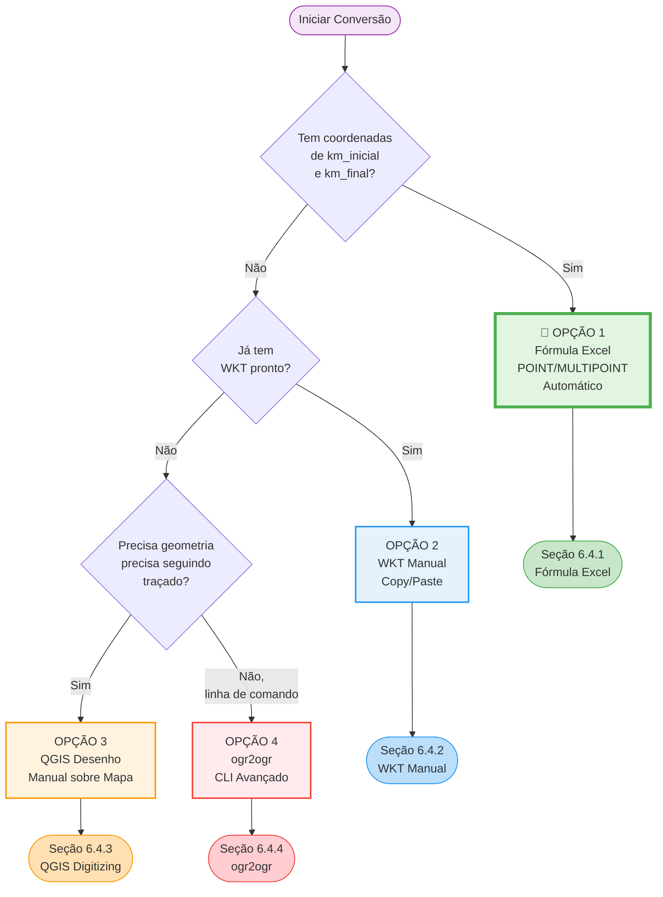

## **6. Conversão de Planilha para GeoJSON (Interface Gráfica)**

Este capítulo apresenta métodos práticos para converter planilhas Excel em arquivos GeoJSON válidos **usando ferramentas de interface gráfica** (QGIS) e edição manual.

**Público-alvo:** Usuários sem conhecimento de programação.

**📥 Download dos Templates:**
Os templates estão disponíveis no Portal de Dados Abertos da ARTESP:
[https://dadosabertos.artesp.sp.gov.br/dataset/programacao-de-obras](https://dadosabertos.artesp.sp.gov.br/dataset/programacao-de-obras)

- `template_lxx_conservacao_2026_r0.xlsx`
- `template_lxx_obras_2026_r0.xlsx`

---

## **6.1 Introdução e Visão Geral**

Este guia apresenta um processo passo a passo para usuários que preferem trabalhar com ferramentas visuais (Excel + QGIS) em vez de programação.

---

### **⚠️ IMPORTANTE: Requisitos de Precisão Geométrica da ARTESP**

A ARTESP adotou o formato GeoJSON especificamente para obter **geometrias realistas e precisas** dos serviços a serem executados.

**Requisitos obrigatórios:**

1. **Serviços lineares** (pavimentação, sinalização horizontal, barreiras) **DEVEM** usar **LineString** que **segue o traçado real da rodovia**.

2. **Serviços de área** (SAU, estacionamentos, áreas de intervenção) **DEVEM** usar **Polygon** representando a **área real** da intervenção.

3. **Serviços pontuais** (instalação de 1 equipamento em 1 local específico) podem usar **Point**.

**❌ NÃO SERÃO ACEITOS:**
- ❌ MULTIPOINT com apenas 2 pontos (início e fim) para representar serviços lineares
- ❌ LineString com apenas 2 pontos (linha reta) que não acompanha o traçado da rodovia
- ❌ Geometrias aproximadas ou simplificadas para obras que requerem precisão

**✅ Implicações para escolha do método:**
- **Opção 1 (Fórmula Excel)**: Gera MULTIPOINT → **Aceita APENAS para serviços pontuais onde km_inicial = km_final**
- **Opção 2 (WKT Manual)**: Aceita **SE** o WKT contiver geometria completa e precisa
- **Opção 3 (QGIS Desenho Manual)**: **RECOMENDADO** para a maioria dos serviços lineares e de área
- **Opção 4 (ogr2ogr)**: Aceita se WKT de entrada já for completo e preciso

**💡 Recomendação:** Para a maioria dos serviços de conservação e obras, use a **Opção 3 (QGIS Desenho Manual)** para garantir conformidade com os requisitos da ARTESP.

---



**Passos do processo:**
1. Preparar a planilha Excel (seção 6.2)
2. Limpar, adicionar coluna ID e coordenadas (seção 6.3)
3. Escolher método de geometria - **4 opções** (seção 6.4):
   - **Opção 1** 🌟: Fórmula Excel automática (mais fácil)
   - **Opção 2**: WKT manual (se já tem WKT)
   - **Opção 3**: QGIS desenho manual (geometrias precisas)
   - **Opção 4**: ogr2ogr CLI (avançado)
4. Exportar para GeoJSON via QGIS (seção 6.5)
5. Adicionar metadados e ajustar formato (seção 6.6)
6. Validar o arquivo (seção 6.7)

---

## **6.2 Passo 1: Preparar a Planilha Excel**

1. **Baixe o template apropriado** do Portal de Dados Abertos:
   - Para conservação: `template_lxx_conservacao_2026_r0.xlsx`
   - Para obras: `template_lxx_obras_2026_r0.xlsx`

2. **Abra o arquivo no Excel ou LibreOffice Calc**

3. **Preencha seus dados seguindo as instruções do template**

**Exemplo de preenchimento para CONSERVAÇÃO:**

| lote | rodovia    | item  | detalhamento_servico              | unidade | quantidade | km_inicial | km_final | local                   | data_inicial | data_final | observacoes_gerais |
|:-----|:-----------|:------|:----------------------------------|:--------|:-----------|:-----------|:---------|:------------------------|:-------------|:-----------|:-------------------|
| L13  | SP0000280  | a.1.1 | Recuperação funcional do pavimento| km      | 5.25       | 22.500     | 27.750   | PISTA_NORTE;PISTA_SUL   | 2026-03-15   | 2026-07-20 | Período noturno    |
| L13  | SP0000330  | c.2.4 | Sinalização vertical              | un      | 15         | 132.100    | 138.500  | PISTA_NORTE             | 2026-02-01   | 2026-02-15 |                    |

**Exemplo de preenchimento para OBRAS:**

| lote | rodovia    | programa | item | subitem | detalhamento_servico           | unidade | quantidade | km_inicial | km_final | local              | data_inicial | data_final | observacoes_gerais |
|:-----|:-----------|:---------|:-----|:--------|:-------------------------------|:--------|:-----------|:-----------|:---------|:-------------------|:-------------|:-----------|:-------------------|
| L19  | SP0000280  | CAPEX    | 1    | 1       | Construção de Passarela        | un      | 1.000      | 25.300     | 25.300   | DISPOSITIVO        | 2026-01-20   | 2026-11-30 | Área comercial     |
| L07  | SPA000292  | REVIT    | 3    | 2       | Faixas adicionais de rolamento | km      | 12.400     | 110.200    | 122.601  | PISTA_LESTE        | 2025-09-01   | 2027-05-15 |                    |

**⚠️ Pontos de Atenção:**

- **Campo `local`**: Use **ponto e vírgula (`;`)** para separar múltiplos locais
  - Exemplo: `PISTA_NORTE;PISTA_SUL;CANTEIRO_CENTRAL`
- **Campo `lote`**: Use o formato **L + 2 dígitos**
  - Correto: `L01`, `L13`, `L22`
  - Errado: `L1`, `L133`, `1`
- **Datas**: Formato **YYYY-MM-DD**
  - Correto: `2026-03-15`
  - Errado: `15/03/2026`, `03-15-2026`
- **Campo `observacoes_gerais`**: Deixe em branco se não houver observações (será convertido para `null`)
- **Separador decimal**: Use **ponto (`.`)**, não vírgula
  - Correto: `125.500`
  - Errado: `125,500`

---

## **6.3 Passo 2: Limpar e Preparar a Planilha**

Antes de importar no QGIS, você precisa preparar a planilha:

**A. Remover Linhas de Cabeçalho e Exemplos:**

1. **Delete as linhas 1-5** do template (cabeçalho, instruções e exemplos)
2. A primeira linha deve conter apenas os nomes das colunas
3. A segunda linha em diante deve conter seus dados reais

**B. Remover Abas Não Utilizadas:**

1. Se o arquivo Excel tiver múltiplas abas, **delete todas** exceto a aba com seus dados
2. Renomeie a aba principal para "Dados" (opcional, mas recomendado)

**C. Adicionar Coluna ID:**

1. **Crie uma nova coluna chamada `id`** (primeira coluna, antes de `lote`)
2. Preencha com identificadores únicos sequenciais:
   - Para conservação: `conserva-001`, `conserva-002`, `conserva-003`, ...
   - Para obras: `obra-001`, `obra-002`, `obra-003`, ...
   - Ou simplesmente: `1`, `2`, `3`, ...

**D. Adicionar Colunas de Coordenadas:**

As coordenadas geográficas dos pontos inicial e final de cada serviço são necessárias para gerar as geometrias.

1. **Adicione 4 novas colunas** após a coluna `id`:
   - `lon_inicio` - Longitude do km_inicial
   - `lat_inicio` - Latitude do km_inicial
   - `lon_fim` - Longitude do km_final
   - `lat_fim` - Latitude do km_final

2. Preencha com as coordenadas em **graus decimais** no sistema **SIRGAS 2000 (EPSG:4674)**

**⚠️ IMPORTANTE: Separador Decimal**

As coordenadas **DEVEM usar PONTO (.) como separador decimal**, não vírgula.

- ✅ **Correto:** `-46.6333` ou `-23.5505`
- ❌ **Errado:** `-46,6333` ou `-23,5505`

**Como garantir formato correto:**

1. **Formate as células como Número:**
   - Selecione as colunas de coordenadas (lon_inicio, lat_inicio, lon_fim, lat_fim)
   - Clique direito → **Formatar Células**
   - Escolha **Número**
   - Configure **6 casas decimais**

2. **Se sua planilha já tem vírgulas**, use **Localizar e Substituir:**
   - Pressione `Ctrl+H`
   - Localizar: `,` (vírgula)
   - Substituir: `.` (ponto)
   - Clique em **Substituir Tudo** (aplique apenas nas colunas de coordenadas)

**Exemplo após limpeza (CONSERVAÇÃO):**

| id           | lon_inicio | lat_inicio | lon_fim  | lat_fim  | lote | rodovia   | item  | detalhamento_servico               | unidade | quantidade | km_inicial | km_final | local                 | data_inicial | data_final | observacoes_gerais |
|:-------------|:-----------|:-----------|:---------|:---------|:-----|:----------|:------|:-----------------------------------|:--------|:-----------|:-----------|:---------|:----------------------|:-------------|:-----------|:-------------------|
| conserva-001 | -46.6333   | -23.5505   | -46.6345 | -23.5515 | L13  | SP0000280 | a.1.1 | Recuperação funcional do pavimento | km      | 5.25       | 22.500     | 27.750   | PISTA_NORTE;PISTA_SUL | 2026-03-15   | 2026-07-20 | Período noturno    |
| conserva-002 | -47.0613   | -22.9054   | -47.0613 | -22.9054 | L13  | SP0000330 | c.2.4 | Sinalização vertical               | un      | 15         | 132.100    | 138.500  | PISTA_NORTE           | 2026-02-01   | 2026-02-15 |                    |

---

## **6.4 Passo 3: Escolher Método de Geometria**

Agora você precisa escolher **uma das quatro opções** para gerar as geometrias WKT a partir das coordenadas:

**Tabela Comparativa:**

| Opção | Método | Melhor Para | Tempo | Dificuldade | Geometrias Geradas | ✅ Aceito ARTESP? |
|:------|:-------|:------------|:------|:------------|:-------------------|:-----------------|
| **1** | Fórmula Excel (automática) | Serviços pontuais (km_inicial = km_final) | 5-10 min | ⭐ Muito Fácil | POINT ou MULTIPOINT | ⚠️ **Apenas POINT** (serviços pontuais). MULTIPOINT **NÃO é aceito** para lineares/área |
| **2** | WKT Manual (cópia/edição) | Quando já tem WKT completo de outra fonte | 15-30 min | ⭐⭐ Fácil | Qualquer tipo | ✅ SE o WKT for completo e preciso |
| **3** 🌟 | **QGIS Desenho Manual** | **Serviços lineares e de área** (RECOMENDADO) | 30-60 min | ⭐⭐⭐ Média | **LineString/Polygon precisos** | ✅ **SIM - Recomendado** |
| **4** | ogr2ogr (CLI avançado) | Conversão de WKT existente completo | 10-20 min | ⭐⭐⭐⭐ Alta | Conversão de WKT | ✅ SE o WKT de entrada for completo |

**⚠️ ATENÇÃO - Requisitos ARTESP:**
- **Serviços lineares** (pavimentação, sinalização, barreiras) → Use **Opção 3** (QGIS Desenho Manual)
- **Serviços de área** (SAU, estacionamentos) → Use **Opção 3** (QGIS Desenho Manual)
- **Serviços pontuais** (1 equipamento em 1 local) → Pode usar **Opção 1** (Fórmula Excel com POINT)

**💡 Recomendação:** Para a **maioria dos serviços de conservação e obras**, use a **Opção 3** (QGIS Desenho Manual) para garantir geometrias precisas que seguem o traçado real da rodovia.

---

### **6.4.1 OPÇÃO 1: Fórmula Excel/Calc para POINT/MULTIPOINT (Automática)** 🌟 RECOMENDADO

Use esta opção quando você tem coordenadas de `km_inicial` e `km_final` e deseja gerar automaticamente geometrias POINT ou MULTIPOINT.

**Quando usar:**
- ✅ Você tem coordenadas dos pontos inicial e final de cada serviço
- ✅ Deseja processo rápido e automático
- ✅ Serviços pontuais ou com dois pontos de referência

**O que a fórmula faz:**
- Se `km_inicial = km_final` (coordenadas iguais) → Gera **POINT** (serviço pontual)
- Se `km_inicial ≠ km_final` (coordenadas diferentes) → Gera **MULTIPOINT** (dois pontos de referência)

---

#### **Passo A: Adicionar Coluna WKT com Fórmula**

1. **Certifique-se** de que você já preencheu as 4 colunas de coordenadas (conforme **Seção 6.3.D**):
   - `lon_inicio`, `lat_inicio`, `lon_fim`, `lat_fim`

2. **Crie uma nova coluna** chamada `wkt` (após as colunas de coordenadas)

3. **Escolha e copie a fórmula adequada** para seu software:

---

#### **📊 Fórmulas por Software**

**MICROSOFT EXCEL (Português):**

```excel
=SE(E(lon_inicio=lon_fim;lat_inicio=lat_fim);"POINT("&lon_inicio&" "&lat_inicio&")";"MULTIPOINT("&lon_inicio&" "&lat_inicio&", "&lon_fim&" "&lat_fim&")")
```

**MICROSOFT EXCEL (English):**

```excel
=IF(AND(lon_inicio=lon_fim,lat_inicio=lat_fim),"POINT("&lon_inicio&" "&lat_inicio&")","MULTIPOINT("&lon_inicio&" "&lat_inicio&", "&lon_fim&" "&lat_fim&")")
```

---

**LIBREOFFICE CALC (Português):**

```calc
=SE(E(lon_inicio=lon_fim;lat_inicio=lat_fim);"POINT("&lon_inicio&" "&lat_inicio&")";"MULTIPOINT("&lon_inicio&" "&lat_inicio&", "&lon_fim&" "&lat_fim&")")
```

**LIBREOFFICE CALC (English):**

```calc
=IF(AND(lon_inicio=lon_fim,lat_inicio=lat_fim),"POINT("&lon_inicio&" "&lat_inicio&")","MULTIPOINT("&lon_inicio&" "&lat_inicio&", "&lon_fim&" "&lat_fim&")")
```

---

**ONLYOFFICE SPREADSHEET (Português):**

```excel
=SE(E(lon_inicio=lon_fim;lat_inicio=lat_fim);"POINT("&lon_inicio&" "&lat_inicio&")";"MULTIPOINT("&lon_inicio&" "&lat_inicio&", "&lon_fim&" "&lat_fim&")")
```

**ONLYOFFICE SPREADSHEET (English):**

```excel
=IF(AND(lon_inicio=lon_fim,lat_inicio=lat_fim),"POINT("&lon_inicio&" "&lat_inicio&")","MULTIPOINT("&lon_inicio&" "&lat_inicio&", "&lon_fim&" "&lat_fim&")")
```

---

4. **Cole a fórmula** na primeira célula da coluna `wkt` (linha 2, se linha 1 é cabeçalho)

5. **Copie a fórmula** para todas as linhas de dados:
   - Selecione a célula com a fórmula
   - Copie (Ctrl+C)
   - Selecione todas as células abaixo (até a última linha de dados)
   - Cole (Ctrl+V)

---

#### **Passo B: Verificar Resultado**

**Exemplo de saída:**

| id           | lon_inicio | lat_inicio | lon_fim  | lat_fim  | wkt | Tipo Gerado |
|:-------------|:-----------|:-----------|:---------|:---------|:----|:------------|
| conserva-001 | -46.6333   | -23.5505   | -46.6333 | -23.5505 | `POINT(-46.6333 -23.5505)` | Pontual (início = fim) |
| conserva-002 | -46.6333   | -23.5505   | -46.6345 | -23.5515 | `MULTIPOINT(-46.6333 -23.5505, -46.6345 -23.5515)` | Dois pontos de referência |

**Verifique:**
- ✅ WKT está no formato correto (sem vírgulas como separador decimal)
- ✅ POINT tem apenas 1 coordenada
- ✅ MULTIPOINT tem 2 coordenadas separadas por vírgula

---

#### **Passo C: Exportar para CSV**

1. **Salve a planilha como CSV:**
   - Menu: **Arquivo → Salvar Como**
   - Formato: **CSV (delimitado por vírgulas) (.csv)**
   - Codificação: **UTF-8**
   - Nome: `dados_com_wkt.csv`

2. **IMPORTANTE:** Verifique que o separador decimal no CSV é **ponto (.)**

---

#### **Passo D: Importar no QGIS**

1. **Abra o QGIS** (baixe em [https://qgis.org/download/](https://qgis.org/download/) se necessário)

2. **Menu:** Camada → Adicionar Camada → **Adicionar Camada de Texto Delimitado**

3. **Configuração:**
   - **Nome da camada:** `conservacao_2026` (ou nome apropriado)
   - **Nome do arquivo:** Selecione seu `dados_com_wkt.csv`
   - **Formato de arquivo:** CSV (vírgulas)
   - **Codificação:** UTF-8
   - **Definição de geometria:** **Definição de geometria WKT**
   - **Campo de geometria:** `wkt`
   - **CRS da geometria:** **EPSG:4674 - SIRGAS 2000**

4. **Clique em "Adicionar"**

5. **Verifique:** As geometrias devem aparecer no mapa

---

#### **Passo E: Prosseguir para Exportação**

Continue para **Seção 6.5** para exportar como GeoJSON.

---

#### **⚠️ Notas Importantes**

**1. POINT vs MULTIPOINT:**
- **POINT:** Serviço em um único local (ex: instalação de equipamento no km 25.3)
- **MULTIPOINT:** Representa dois pontos de referência (início e fim do trecho)
- **MULTIPOINT NÃO é a geometria completa da rodovia** - são apenas pontos de referência

**2. Quando MULTIPOINT é apropriado:**
- ✅ Para visualização dos pontos de início e fim do serviço
- ✅ Quando precisão da geometria intermediária não é crítica
- ✅ Como solução rápida e automática

**3. Quando MULTIPOINT NÃO é apropriado:**
- ❌ Se você precisa de LineString que segue o traçado da rodovia
- ❌ Se você precisa de Polygon representando área precisa
- ❌ Se requisitos exigem geometria detalhada

**Para geometrias precisas (LineString/Polygon seguindo traçado), use Opção 3 (QGIS Desenho Manual).**

**4. Separador Decimal:**
- A fórmula gera WKT com ponto (.) como separador
- Se você vê vírgulas no WKT, revise a **Seção 6.3.D** sobre formatação de coordenadas

---

#### **📋 Fórmula com Validação Automática (Avançado)**

Se você quer que a fórmula converta automaticamente vírgulas para pontos no WKT, use esta versão:

**Excel/OnlyOffice (Português) - COM VALIDAÇÃO:**

```excel
=SE(SOMA(ÉNÚM(lon_inicio);ÉNÚM(lat_inicio);ÉNÚM(lon_fim);ÉNÚM(lat_fim))<4;"❌ ERRO: Coordenadas inválidas";SE(E(lon_inicio=lon_fim;lat_inicio=lat_fim);"POINT("&SUBSTITUIR(TEXTO(lon_inicio;"0.000000");",";".")&" "&SUBSTITUIR(TEXTO(lat_inicio;"0.000000");",";".")&")";"MULTIPOINT("&SUBSTITUIR(TEXTO(lon_inicio;"0.000000");",";".")&" "&SUBSTITUIR(TEXTO(lat_inicio;"0.000000");",";".")&", "&SUBSTITUIR(TEXTO(lon_fim;"0.000000");",";".")&" "&SUBSTITUIR(TEXTO(lat_fim;"0.000000");",";".")&")"))
```

**Excel/OnlyOffice (English) - WITH VALIDATION:**

```excel
=IF(SUM(ISNUMBER(lon_inicio),ISNUMBER(lat_inicio),ISNUMBER(lon_fim),ISNUMBER(lat_fim))<4,"❌ ERROR: Invalid coordinates",IF(AND(lon_inicio=lon_fim,lat_inicio=lat_fim),"POINT("&SUBSTITUTE(TEXT(lon_inicio,"0.000000"),",",".")&" "&SUBSTITUTE(TEXT(lat_inicio,"0.000000"),",",".")&")","MULTIPOINT("&SUBSTITUTE(TEXT(lon_inicio,"0.000000"),",",".")&" "&SUBSTITUTE(TEXT(lat_inicio,"0.000000"),",",".")&", "&SUBSTITUTE(TEXT(lon_fim,"0.000000"),",",".")&" "&SUBSTITUTE(TEXT(lat_fim,"0.000000"),",",".")&")"))
```

**LibreOffice Calc (Português) - COM VALIDAÇÃO:**

```calc
=SE(SOMA(ÉNÚMERO(lon_inicio);ÉNÚMERO(lat_inicio);ÉNÚMERO(lon_fim);ÉNÚMERO(lat_fim))<4;"❌ ERRO: Coordenadas inválidas";SE(E(lon_inicio=lon_fim;lat_inicio=lat_fim);"POINT("&SUBSTITUIR(TEXTO(lon_inicio;"0,000000");",";".")&" "&SUBSTITUIR(TEXTO(lat_inicio;"0,000000");",";".")&")";"MULTIPOINT("&SUBSTITUIR(TEXTO(lon_inicio;"0,000000");",";".")&" "&SUBSTITUIR(TEXTO(lat_inicio;"0,000000");",";".")&", "&SUBSTITUIR(TEXTO(lon_fim;"0,000000");",";".")&" "&SUBSTITUIR(TEXTO(lat_fim;"0,000000");",";".")&")"))
```

**LibreOffice Calc (English) - WITH VALIDATION:**

```calc
=IF(SUM(ISNUMBER(lon_inicio),ISNUMBER(lat_inicio),ISNUMBER(lon_fim),ISNUMBER(lat_fim))<4,"❌ ERROR: Invalid coordinates",IF(AND(lon_inicio=lon_fim,lat_inicio=lat_fim),"POINT("&SUBSTITUTE(TEXT(lon_inicio,"0.000000"),",",".")&" "&SUBSTITUTE(TEXT(lat_inicio,"0.000000"),",",".")&")","MULTIPOINT("&SUBSTITUTE(TEXT(lon_inicio,"0.000000"),",",".")&" "&SUBSTITUTE(TEXT(lat_inicio,"0.000000"),",",".")&", "&SUBSTITUTE(TEXT(lon_fim,"0.000000"),",",".")&" "&SUBSTITUTE(TEXT(lat_fim,"0.000000"),",",".")&")"))
```

**Essa fórmula:**
- ✅ Valida se as coordenadas são números válidos
- ✅ Converte automaticamente vírgulas para pontos
- ✅ Mantém 6 casas decimais
- ❌ Mostra erro se dados estiverem incorretos

**Use a versão simples se suas coordenadas já estão formatadas corretamente com ponto decimal.**

---

#### **🔧 Solução de Problemas Comuns**

**Problema 1: WKT gerado com vírgulas no lugar de pontos**

**Sintoma:**
```
MULTIPOINT(-46,6333 -23,5505, -46,6345 -23,5515)  ❌ INVÁLIDO
```

**Soluções:**

**Opção A:** Use a fórmula com validação (seção acima) que converte automaticamente

**Opção B:** Formate as células de coordenadas como Número:
1. Selecione colunas lon_inicio, lat_inicio, lon_fim, lat_fim
2. Clique direito → Formatar Células → Número
3. Casas decimais: 6
4. Refaça a fórmula WKT

**Opção C:** Localizar e Substituir no WKT gerado:
1. Selecione a coluna `wkt`
2. Ctrl+H (Localizar e Substituir)
3. Localizar: `,`
4. Substituir: `.`
5. **ATENÇÃO:** Isto substituirá TODAS as vírgulas, inclusive as que separam coordenadas no MULTIPOINT
6. **Solução:** Substituir primeiro `, ` (vírgula+espaço) por `; ` (ponto-e-vírgula+espaço), depois `,` por `.`, depois `; ` de volta para `, `

**Opção D (Mais Segura):** Use substituição com regex no VS Code:
1. Abra o CSV no VS Code
2. Ctrl+H, ative regex (ícone `.*`)
3. Localizar: `(-?\d+),(\d+)`
4. Substituir: `$1.$2`
5. Substituir Tudo

---

**Problema 2: Fórmula retorna erro #NOME? ou #VALUE!**

**Causas possíveis:**

1. **Nomes de função em idioma errado:**
   - Se Excel está em português, use `SE`, `E`, `CONCATENAR`
   - Se Excel está em inglês, use `IF`, `AND`, `CONCATENATE`

2. **Nomes de colunas incorretos:**
   - Verifique se as colunas se chamam exatamente: `lon_inicio`, `lat_inicio`, `lon_fim`, `lat_fim`
   - Sem espaços, sem acentos

3. **Células vazias:**
   - Certifique-se de que todas as 4 colunas de coordenadas estão preenchidas
   - Use a fórmula com validação para detectar células vazias

---

**Problema 3: MULTIPOINT sempre gerado, mesmo quando coordenadas são iguais**

**Causa:** Coordenadas aparentemente iguais têm pequenas diferenças nas casas decimais

**Solução:** Arredonde as coordenadas para 6 casas decimais:

```excel
=SE(E(ARRED(lon_inicio;6)=ARRED(lon_fim;6);ARRED(lat_inicio;6)=ARRED(lat_fim;6));"POINT("&lon_inicio&" "&lat_inicio&")";"MULTIPOINT("&lon_inicio&" "&lat_inicio&", "&lon_fim&" "&lat_fim&")")
```

---

**Problema 4: QGIS não reconhece geometrias ao importar CSV**

**Soluções:**

1. **Verifique formato do WKT:**
   - Deve ser exatamente: `POINT(lon lat)` ou `MULTIPOINT(lon1 lat1, lon2 lat2)`
   - Sem aspas extras, sem espaços no início/fim

2. **Verifique codificação do CSV:**
   - Deve ser UTF-8
   - Ao salvar, escolha explicitamente "CSV UTF-8"

3. **Configuração no QGIS:**
   - "Definição de geometria": selecione "Definição de geometria WKT"
   - "Campo de geometria": selecione a coluna `wkt`
   - "CRS da geometria": EPSG:4674

4. **Sepador de CSV:**
   - Se o CSV usa ponto-e-vírgula (`;`) como delimitador, altere nas configurações do QGIS
   - Ou salve novamente o Excel como "CSV (delimitado por vírgulas)"

---

### **6.4.2 OPÇÃO 2: Coluna WKT Manual (geometria pronta)**

Use esta opção se você **já tem** as geometrias no formato **WKT (Well-Known Text)** de outra fonte ou sistema.

**💡 Nota:** Se você tem coordenadas de km_inicial e km_final, use a **Opção 1** (Fórmula Excel) que é mais fácil e automática!

**Quando usar esta opção:**
- ✅ Você recebeu WKT pronto de outro sistema/colega
- ✅ Precisa de geometrias complexas (Polygon, LineString com muitos pontos intermediários)
- ✅ Já tem WKT e quer apenas importar no QGIS

**A. Adicionar Coluna WKT:**

1. **Crie uma nova coluna chamada `wkt`**
2. Preencha com geometrias no formato WKT:
   - **Ponto**: `POINT(-46.633308 -23.550520)`
   - **Linha**: `LINESTRING(-46.633308 -23.550520, -46.634567 -23.551234)`
   - **Polígono**: `POLYGON((-46.633308 -23.550520, -46.634567 -23.551234, -46.635000 -23.552000, -46.633308 -23.550520))`

**Exemplo:**

| id           | wkt                                                                  | lote | rodovia   | item  | ... |
|:-------------|:---------------------------------------------------------------------|:-----|:----------|:------|:----|
| conserva-001 | LINESTRING(-46.633308 -23.550520, -46.634567 -23.551234)            | L13  | SP0000280 | a.1.1 | ... |
| conserva-002 | POINT(-46.635000 -23.552000)                                         | L13  | SP0000330 | c.2.4 | ... |

**B. Exportar para CSV:**

1. Salve a planilha como **CSV** (Menu → Salvar Como → CSV UTF-8)
2. Nomeie o arquivo: `dados_com_wkt.csv`

**C. Importar no QGIS:**

1. Abra o QGIS
2. Menu: **Camada → Adicionar Camada → Adicionar Camada de Texto Delimitado**
3. Selecione seu arquivo CSV
4. Configure:
   - **Formato de arquivo**: CSV
   - **Geometria**: **Definição de geometria WKT**
   - **Campo de geometria**: `wkt`
   - **CRS da geometria**: **EPSG:4674 - SIRGAS 2000**
5. Clique em **"Adicionar"**

**D. Prosseguir para o Passo 4** (Exportar para GeoJSON)

---

### **6.4.3 OPÇÃO 3: QGIS Desenho Manual (geometrias precisas)**

Use esta opção quando você precisa desenhar geometrias **precisas** que seguem o traçado da rodovia, ou quando precisa criar Polygons/LineStrings complexos.

**Quando usar:**
- ✅ Precisa de LineString que segue o traçado da rodovia
- ✅ Precisa desenhar Polygons (áreas de intervenção, SAU, estacionamentos)
- ✅ Quer geometrias com precisão visual sobre mapa base
- ✅ Tem tempo para desenhar manualmente cada geometria

**⚠️ Nota:** Este método é mais demorado, mas produz geometrias mais precisas que MULTIPOINT ou LineStrings simples.

---

#### **Passo A: Preparar Pontos de Referência**

1. **Adicione colunas de referência** (opcional, mas recomendado):
   - `lat_ref`, `lon_ref` - Coordenada aproximada para cada serviço
   - Pode ser o ponto médio do trecho, ou coordenada de km_inicial
   - Servirá apenas para localizar o serviço no mapa

2. **Exporte para CSV:**
   - Arquivo → Salvar Como → CSV UTF-8
   - Nome: `dados_referencia.csv`

---

#### **Passo B: Importar Pontos de Referência no QGIS**

1. **Abra o QGIS**

2. **Adicione os pontos de referência:**
   - Menu: Camada → Adicionar Camada → **Adicionar Camada de Texto Delimitado**
   - Selecione `dados_referencia.csv`
   - Configure:
     - **Geometria**: Coordenadas de ponto
     - **Campo X**: `lon_ref`
     - **Campo Y**: `lat_ref`
     - **CRS**: EPSG:4674
   - Clique em "Adicionar"

3. **Os pontos aparecerão no mapa** para referência visual

---

#### **Passo C: Adicionar Mapa Base**

Para desenhar geometrias precisas, você precisa de um mapa base (satélite ou ruas).

**Opção 1: Plugin QuickMapServices (Recomendado)**

1. **Instale o plugin:**
   - Menu: Plugins → Gerenciar e Instalar Plugins
   - Busque: "QuickMapServices"
   - Clique em "Instalar Plugin"

2. **Adicione mapa base:**
   - Menu: Web → QuickMapServices → OSM → **OSM Standard**
   - Ou: **Google Satellite** (se disponível após configurar "Get contributed pack")

**Opção 2: XYZ Tiles**

1. **Adicione camada XYZ:**
   - Painel Navegador → XYZ Tiles → clique direito → New Connection
   - Nome: `Google Satellite`
   - URL: `https://mt1.google.com/vt/lyrs=s&x={x}&y={y}&z={z}`
   - Clique OK

2. **Adicione ao mapa:**
   - Duplo clique em "Google Satellite" no painel Navegador

---

#### **Passo D: Criar Camada de Geometrias**

1. **Crie nova camada:**
   - Menu: Camada → Criar Camada → **Nova Camada GeoPackage** (ou Shapefile)
   - Configure:
     - **Nome do banco de dados**: `conservacao_2026.gpkg` (escolha local para salvar)
     - **Nome da tabela**: `servicos`
     - **Tipo de geometria**: Escolha conforme necessidade:
       - **Point**: serviços pontuais
       - **LineString**: serviços lineares (pavimento, sinalização, etc.)
       - **Polygon**: áreas (SAU, estacionamento, áreas de intervenção)
       - **MultiPoint**: múltiplos pontos discretos
     - **CRS**: EPSG:4674 - SIRGAS 2000

2. **Adicione campos de atributos:**
   - Clique em "Novos campos" e adicione os campos do schema:
     - `id` (Texto, tamanho 50)
     - `lote` (Texto, tamanho 10)
     - `rodovia` (Texto, tamanho 20)
     - `item` (Texto, tamanho 10)
     - `detalhamento_servico` (Texto, tamanho 255)
     - `unidade` (Texto, tamanho 10)
     - `quantidade` (Número decimal)
     - `km_inicial` (Número decimal)
     - `km_final` (Número decimal)
     - `data_inicial` (Data)
     - `data_final` (Data)
     - `observacoes_gerais` (Texto, tamanho 255)
   - Clique OK

---

#### **Passo E: Desenhar Geometrias**

1. **Ative o modo de edição:**
   - Selecione a camada criada
   - Clique no ícone do lápis (ou F9) para **Alternar Edição**

2. **Ferramentas de desenho:**

   **Para POINT:**
   - Clique no ícone "Adicionar Feição de Ponto"
   - Clique no local do serviço no mapa
   - Preencha os atributos na janela que aparece
   - Clique OK

   **Para LineString:**
   - Clique no ícone "Adicionar Feição de Linha"
   - Clique sucessivamente ao longo da rodovia para criar vértices
   - **Siga o traçado da rodovia** usando o mapa base como guia
   - Clique direito para finalizar a linha
   - Preencha os atributos
   - Clique OK

   **Para Polygon:**
   - Clique no ícone "Adicionar Feição de Polígono"
   - Clique nos vértices ao redor da área
   - Feche o polígono clicando direito
   - Preencha os atributos
   - Clique OK

3. **Dicas de digitalização:**
   - Use **Zoom** (roda do mouse) para ver detalhes
   - Use **Pan** (arrastar com botão central do mouse ou Espaço+arrastar)
   - Pressione **Ctrl+Z** para desfazer último vértice
   - Use **Snapping** (ímã) para conectar geometrias: Projeto → Opções de Snapping

4. **Copiar atributos da camada de referência:**
   - Abra a tabela de atributos da camada de pontos de referência
   - Copie os valores (id, lote, rodovia, etc.)
   - Cole na feição que você está criando

---

#### **Passo F: Salvar Edições**

1. **Salvar:**
   - Clique no ícone "Salvar Edições" (disco)
   - Ou pressione Ctrl+S

2. **Desativar edição:**
   - Clique novamente no ícone do lápis
   - Confirme salvar se solicitado

---

#### **Passo G: Verificar Geometrias**

1. **Verifique visualmente:**
   - As geometrias devem aparecer sobre o mapa base
   - LineStrings devem seguir o traçado da rodovia
   - Polygons devem cobrir as áreas corretas

2. **Abra a tabela de atributos:**
   - Clique direito na camada → Abrir Tabela de Atributos
   - Verifique se todos os campos estão preenchidos

---

#### **Passo H: Prosseguir para Exportação**

Continue para **Seção 6.5** para exportar como GeoJSON.

---

#### **📋 Recursos Úteis**

- **Tutorial de Digitalização QGIS:** [https://docs.qgis.org/latest/pt_BR/docs/user_manual/working_with_vector/editing_geometry_attributes.html](https://docs.qgis.org/latest/pt_BR/docs/user_manual/working_with_vector/editing_geometry_attributes.html)
- **Vídeo tutorial (YouTube):** Busque "QGIS digitizing tutorial"
- **Atalhos de teclado:** F9 (alternar edição), Ctrl+. (adicionar feature), Ctrl+Z (desfazer)

---

### **6.4.4 OPÇÃO 4: ogr2ogr (Conversão Direta CSV → GeoJSON)** ⚠️ Método Avançado

**⚠️ ATENÇÃO:** Este método requer conhecimento de linha de comando e instalação do GDAL. Se você é iniciante, recomendamos usar a **Opção 1** ou **Opção 2**.

Use esta opção se você prefere usar linha de comando e já tem as geometrias no CSV (como WKT ou lat/lon).

**O que é ogr2ogr:**
`ogr2ogr` é uma ferramenta de linha de comando do GDAL que converte entre diversos formatos geoespaciais, incluindo CSV para GeoJSON.

**A. Instalação:**

- **Linux**:
  ```bash
  sudo apt install gdal-bin  # Debian/Ubuntu
  sudo pacman -S gdal        # Arch Linux
  ```

- **Mac**:
  ```bash
  brew install gdal
  ```

- **Windows**:
  - Baixe OSGeo4W: [https://trac.osgeo.org/osgeo4w/](https://trac.osgeo.org/osgeo4w/)
  - Ou instale via conda: `conda install -c conda-forge gdal`

**B. Preparar CSV com Geometria WKT:**

Certifique-se de que seu CSV tem uma coluna `wkt` com as geometrias:

```csv
id,wkt,lote,rodovia,item,detalhamento_servico,unidade,quantidade,km_inicial,km_final,local,data_inicial,data_final,observacoes_gerais
conserva-001,"LINESTRING(-46.633308 -23.550520, -46.634567 -23.551234)",L13,SP0000280,a.1.1,Recuperação funcional do pavimento,km,5.25,22.500,27.750,PISTA_NORTE;PISTA_SUL,2026-03-15,2026-07-20,Período noturno
conserva-002,"POINT(-46.635000 -23.552000)",L13,SP0000330,c.2.4,Sinalização vertical,un,15,132.100,138.500,PISTA_NORTE,2026-02-01,2026-02-15,
```

**C. Converter usando ogr2ogr:**

**Opção C.1: CSV com coluna WKT**

```bash
ogr2ogr -f GeoJSON \
  -s_srs EPSG:4674 \
  -t_srs EPSG:4674 \
  -oo GEOM_POSSIBLE_NAMES=wkt \
  -oo KEEP_GEOM_COLUMNS=NO \
  L13_conservacao_2026_R0.geojson \
  dados_com_wkt.csv
```

**Opção C.2: CSV com colunas lat/lon**

```bash
ogr2ogr -f GeoJSON \
  -s_srs EPSG:4674 \
  -t_srs EPSG:4674 \
  -oo X_POSSIBLE_NAMES=lon \
  -oo Y_POSSIBLE_NAMES=lat \
  -oo KEEP_GEOM_COLUMNS=NO \
  L13_conservacao_2026_R0.geojson \
  dados_com_latlon.csv
```

**Explicação dos parâmetros:**
- `-f GeoJSON`: Formato de saída
- `-s_srs EPSG:4674`: Sistema de referência de origem (SIRGAS 2000)
- `-t_srs EPSG:4674`: Sistema de referência de destino (SIRGAS 2000)
- `-oo GEOM_POSSIBLE_NAMES=wkt`: Nome da coluna com geometria WKT
- `-oo X_POSSIBLE_NAMES=lon`: Nome da coluna com longitude
- `-oo Y_POSSIBLE_NAMES=lat`: Nome da coluna com latitude
- `-oo KEEP_GEOM_COLUMNS=NO`: Não manter colunas wkt/lat/lon no GeoJSON final

**D. Resultado Esperado:**

O GeoJSON gerado terá esta estrutura:

```json
{
  "type": "FeatureCollection",
  "name": "dados_com_wkt",
  "features": [
    {
      "type": "Feature",
      "properties": {
        "id": "conserva-001",
        "lote": "L13",
        "rodovia": "SP0000280",
        "item": "a.1.1",
        "local": "PISTA_NORTE;PISTA_SUL",
        ...
      },
      "geometry": {
        "type": "LineString",
        "coordinates": [[-46.633308, -23.55052], [-46.634567, -23.551234]]
      }
    }
  ]
}
```

**E. ⚠️ IMPORTANTE - Ajustes Necessários:**

O arquivo gerado pelo `ogr2ogr` **NÃO estará 100% conforme o schema R0**. Você ainda precisará:

1. ❌ **Remover campo `name`** (se existir):
   - Deletar a linha `"name": "dados_com_wkt",`

2. ❌ **Adicionar campo `crs` correto**:
   - O ogr2ogr pode omitir o CRS ou usar formato RFC7946
   - Você precisa adicionar manualmente:
   ```json
   "crs": {
     "type": "name",
     "properties": {
       "name": "urn:ogc:def:crs:EPSG::4674"
     }
   },
   ```

3. ❌ **Adicionar campo `metadata`**:
   ```json
   "metadata": {
     "schema_version": "R0",
     "data_geracao": "2025-11-08T10:30:00-03:00"
   },
   ```

4. ❌ **Converter campo `local` de string para array**:
   - De: `"local": "PISTA_NORTE;PISTA_SUL"`
   - Para: `"local": ["PISTA_NORTE", "PISTA_SUL"]`
   - Use uma das opções descritas no **Passo 5** (manual, regex, script Python, ou jq)

**Vantagens:**
- ✅ Geometria já vem pronta no GeoJSON
- ✅ Não precisa usar interface gráfica do QGIS
- ✅ Rápido para grandes volumes de dados
- ✅ Pode ser automatizado em scripts

**Desvantagens:**
- ❌ Requer instalação do GDAL/ogr2ogr
- ❌ Ainda precisa de ajustes manuais no JSON (CRS, metadata, campo `local`)
- ❌ Requer conhecimento de linha de comando

**F. Prosseguir para o Passo 5** (Adicionar Metadados e Ajustar Formato)

---

## **6.5 Passo 4: Exportar para GeoJSON (QGIS)**

**📋 Este passo se aplica a:**
- ✅ **Opção 1** (Fórmula Excel) - Você importou CSV com WKT no QGIS
- ✅ **Opção 2** (WKT Manual) - Você importou CSV com WKT no QGIS
- ✅ **Opção 3** (QGIS Desenho Manual) - Você desenhou geometrias em GeoPackage/Shapefile
- ❌ **Opção 4** (ogr2ogr) - Pule direto para **Seção 6.6**

---

Agora você tem uma camada com geometrias no QGIS e precisa exportá-la como GeoJSON.

**A. Exportar:**

1. **Selecione a camada** no painel de camadas (a que contém suas geometrias finais)

2. Clique com **botão direito** na camada → **"Exportar → Salvar Feições Como..."**

3. **Configure a exportação:**
   - **Formato**: **GeoJSON**
   - **Nome do arquivo**: `L13_conservacao_2026_R0.geojson` (ajuste conforme seu lote e tipo)
     - Para conservação: `L[número]_conservacao_2026_R0.geojson`
     - Para obras: `L[número]_obras_2026_R0.geojson`
   - **SRC**: **EPSG:4674 - SIRGAS 2000**
   - **Precisão de coordenadas**: **6** casas decimais
   - **Codificação**: UTF-8

4. Clique em **"OK"**

5. **Verifique:** Um arquivo `.geojson` deve ser criado no local especificado

---

**B. Remover Colunas Auxiliares (se necessário):**

Se você usou colunas auxiliares (`lat_ref`, `lon_ref`, `lon_inicio`, `lat_inicio`, `lon_fim`, `lat_fim`, ou `wkt`) durante o processo, essas colunas podem ter sido exportadas como propriedades. Você precisa removê-las do GeoJSON final.

**Como remover:**

1. **Abra o arquivo GeoJSON** em um editor de texto:
   - VS Code (recomendado)
   - Notepad++
   - Sublime Text

2. **Localize as propriedades auxiliares** dentro de cada feature:
   ```json
   "properties": {
     "id": "conserva-001",
     "lote": "L13",
     "lon_inicio": -46.6333,    ← REMOVER
     "lat_inicio": -23.5505,     ← REMOVER
     "lon_fim": -46.6345,        ← REMOVER
     "lat_fim": -23.5515,        ← REMOVER
     "wkt": "MULTIPOINT(...)",   ← REMOVER
     "rodovia": "SP0000280",
     ...
   }
   ```

3. **Delete essas linhas** para cada feature

4. **Salve o arquivo**

**💡 Dica:** Se você tem muitas features, use a funcionalidade de "Find & Replace" do VS Code:
- Procure por: `"lon_inicio":.*,\n` ou `"wkt":.*,\n`
- Substitua por: (vazio)
- Repita para cada coluna auxiliar

---

## **6.6 Passo 5: Adicionar Metadados e Ajustar Formato**

Abra o arquivo GeoJSON em um editor de texto e faça os seguintes ajustes.

**NOTA:** Se você usou **Opção 4 (ogr2ogr)**, você também precisa remover o campo `name` e adicionar os campos `crs` e `metadata` conforme descrito na Opção 4, seção E.

---

### **6.6.1 Converter Campo `local` de String para Array (Obrigatório)**

O campo `local` no GeoJSON exportado estará como string delimitada por `;`. Você precisa convertê-lo para array.

**De:**
```json
"local": "PISTA_NORTE;PISTA_SUL"
```

**Para:**
```json
"local": ["PISTA_NORTE", "PISTA_SUL"]
```

Escolha **uma das opções** abaixo para fazer essa conversão:

---

#### **Opção 1: Edição Manual** (para poucos registros)

Se você tem poucos registros, edite manualmente no editor de texto:

1. Localize cada ocorrência de `"local": "..."`
2. Substitua manualmente pela sintaxe de array

**Vantagens:** Simples, não requer ferramentas adicionais
**Desvantagens:** Trabalhoso para muitos registros

---

#### **Opção 2: Busca e Substituição com Regex no VS Code** (recomendado)

Use expressões regulares no VS Code para conversão semiautomática:

1. Abra o arquivo GeoJSON no **VS Code**
2. Pressione `Ctrl+H` (ou `Cmd+H` no Mac) para abrir Find & Replace
3. Clique no ícone `.*` para ativar **Regex**
4. Configure:
   - **Find**: `"local": "([^"]+)"`
   - **Replace**: `"local": "$1"`
5. **Revise manualmente** cada ocorrência e ajuste:
   - Para `PISTA_NORTE;PISTA_SUL` → digite `["PISTA_NORTE", "PISTA_SUL"]`
   - Para `PISTA_NORTE` → digite `["PISTA_NORTE"]`
   - Para campo vazio → digite `[]`

**Vantagens:** Mais rápido que manual, com controle visual
**Desvantagens:** Requer ajuste manual de cada substituição

---

#### **Opção 3: Script Python Automático** (mais confiável)

Use um script Python para conversão automática e segura:

**Crie um arquivo chamado `converter_local.py`:**

```python
import json
import sys

def converter_local_para_array(arquivo_geojson):
    """
    Converte o campo 'local' de string delimitada por ';' para array.
    """
    print(f"Processando arquivo: {arquivo_geojson}")

    # Ler o arquivo GeoJSON
    with open(arquivo_geojson, 'r', encoding='utf-8') as f:
        data = json.load(f)

    # Processar cada feature
    count = 0
    for feature in data.get('features', []):
        local_value = feature['properties'].get('local', '')

        if isinstance(local_value, str):
            if local_value.strip():
                # Converter string delimitada em array
                feature['properties']['local'] = [
                    loc.strip() for loc in local_value.split(';') if loc.strip()
                ]
            else:
                # String vazia → array vazio
                feature['properties']['local'] = []
            count += 1
        # Se já for array, manter como está

    # Salvar arquivo modificado
    with open(arquivo_geojson, 'w', encoding='utf-8') as f:
        json.dump(data, f, ensure_ascii=False, indent=2)

    print(f"✅ Convertidos {count} campos 'local' para array.")
    print(f"✅ Arquivo atualizado: {arquivo_geojson}")

if __name__ == "__main__":
    if len(sys.argv) != 2:
        print("Uso: python converter_local.py <arquivo.geojson>")
        print("Exemplo: python converter_local.py L13_conservacao_2026_R0.geojson")
        sys.exit(1)

    converter_local_para_array(sys.argv[1])
```

**Como usar:**

```bash
python converter_local.py L13_conservacao_2026_R0.geojson
```

**Vantagens:** Automático, confiável, processa qualquer quantidade de registros
**Desvantagens:** Requer Python instalado

---

#### **Opção 4: jq (Ferramenta CLI)** (para usuários avançados)

Se você tem `jq` instalado (ferramenta de processamento JSON via linha de comando):

**Instalação do jq:**
- **Linux**: `sudo apt install jq` ou `sudo pacman -S jq`
- **Mac**: `brew install jq`
- **Windows**: Baixe em [https://stedolan.github.io/jq/](https://stedolan.github.io/jq/)

**Comando:**

```bash
jq '.features[].properties.local |= (
  if type == "string" then
    split(";") | map(gsub("^\\s+|\\s+$"; "")) | map(select(length > 0))
  else
    .
  end
)' arquivo.geojson > arquivo_convertido.geojson
```

**Ou sobrescrever o arquivo original:**

```bash
jq '.features[].properties.local |= (
  if type == "string" then
    split(";") | map(gsub("^\\s+|\\s+$"; "")) | map(select(length > 0))
  else
    .
  end
)' arquivo.geojson | sponge arquivo.geojson
```

*(requer `moreutils` para o comando `sponge`)*

**Vantagens:** Extremamente rápido, ideal para arquivos grandes
**Desvantagens:** Requer instalação e conhecimento de jq

---

**💡 Recomendação:**
- **Poucos registros (< 10)**: Use **Opção 1** (manual)
- **Registros médios (10-100)**: Use **Opção 2** (Regex no VS Code)
- **Muitos registros (> 100)**: Use **Opção 3** (Script Python) ou **Opção 4** (jq)

---

### **6.6.2 Adicionar Metadados ao Arquivo**

Logo após a linha `"type": "FeatureCollection",`, adicione:

```json
"crs": {
  "type": "name",
  "properties": {
    "name": "urn:ogc:def:crs:EPSG::4674"
  }
},
"metadata": {
  "schema_version": "R0",
  "data_geracao": "2025-11-08T10:30:00-03:00"
},
```

**Ajuste a data em `data_geracao`** para a data/hora atual.

**Ferramentas de edição JSON recomendadas:**
- **VS Code** com extensão "JSON Tools"
- **Notepad++** com plugin JSON Viewer
- **JSONLint** (online): [https://jsonlint.com/](https://jsonlint.com/)

---

## **6.7 Passo 6: Validar o Arquivo**

Após criar e ajustar o GeoJSON, **valide-o** usando o script fornecido pela ARTESP:

```bash
# Baixe o script validar_geojson.py e os schemas do Portal de Dados Abertos
# Execute:
python validar_geojson.py schemas/conserva.schema.r0.json L13_conservacao_2026_R0.geojson
```

**Ou use ferramentas online:**
- [GeoJSONLint](https://geojsonlint.com/)
- [JSON Schema Validator](https://www.jsonschemavalidator.net/)

O script verificará:
- ✅ Conformidade com o schema
- ✅ Unicidade dos IDs
- ✅ Formato dos campos
- ✅ CRS correto
- ✅ Geometrias válidas

---

**🎉 Parabéns!** Se a validação passou, seu arquivo GeoJSON está pronto para envio à ARTESP.
