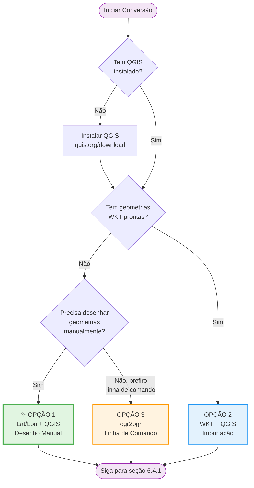

## **6. Conversão de Planilha para GeoJSON (Interface Gráfica)**

Este capítulo apresenta métodos práticos para converter planilhas Excel em arquivos GeoJSON válidos **usando ferramentas de interface gráfica** (QGIS) e edição manual.

**Público-alvo:** Usuários sem conhecimento de programação.

**📥 Download dos Templates:**
Os templates estão disponíveis no Portal de Dados Abertos da ARTESP:
[https://dadosabertos.artesp.sp.gov.br/dataset/programacao-de-obras](https://dadosabertos.artesp.sp.gov.br/dataset/programacao-de-obras)

- `template_lxx_conservacao_2026_r0.xlsx`
- `template_lxx_obras_2026_r0.xlsx`

---

## **6.1 Introdução e Visão Geral**

Este guia apresenta um processo passo a passo para usuários que preferem trabalhar com ferramentas visuais (QGIS) em vez de programação.



**Passos do processo:**
1. Preparar a planilha Excel
2. Limpar e adicionar coluna ID
3. Escolher método de geometria (3 opções)
4. Exportar para GeoJSON via QGIS
5. Adicionar metadados e ajustar formato
6. Validar o arquivo

---

## **6.2 Passo 1: Preparar a Planilha Excel**

1. **Baixe o template apropriado** do Portal de Dados Abertos:
   - Para conservação: `template_lxx_conservacao_2026_r0.xlsx`
   - Para obras: `template_lxx_obras_2026_r0.xlsx`

2. **Abra o arquivo no Excel ou LibreOffice Calc**

3. **Preencha seus dados seguindo as instruções do template**

**Exemplo de preenchimento para CONSERVAÇÃO:**

| lote | rodovia    | item  | detalhamento_servico              | unidade | quantidade | km_inicial | km_final | local                   | data_inicial | data_final | observacoes_gerais |
|:-----|:-----------|:------|:----------------------------------|:--------|:-----------|:-----------|:---------|:------------------------|:-------------|:-----------|:-------------------|
| L13  | SP0000280  | a.1.1 | Recuperação funcional do pavimento| km      | 5.25       | 22.500     | 27.750   | PISTA_NORTE;PISTA_SUL   | 2026-03-15   | 2026-07-20 | Período noturno    |
| L13  | SP0000330  | c.2.4 | Sinalização vertical              | un      | 15         | 132.100    | 138.500  | PISTA_NORTE             | 2026-02-01   | 2026-02-15 |                    |

**Exemplo de preenchimento para OBRAS:**

| lote | rodovia    | programa | item | subitem | detalhamento_servico           | unidade | quantidade | km_inicial | km_final | local              | data_inicial | data_final | observacoes_gerais |
|:-----|:-----------|:---------|:-----|:--------|:-------------------------------|:--------|:-----------|:-----------|:---------|:-------------------|:-------------|:-----------|:-------------------|
| L19  | SP0000280  | CAPEX    | 1    | 1       | Construção de Passarela        | un      | 1.000      | 25.300     | 25.300   | DISPOSITIVO        | 2026-01-20   | 2026-11-30 | Área comercial     |
| L07  | SPA000292  | REVIT    | 3    | 2       | Faixas adicionais de rolamento | km      | 12.400     | 110.200    | 122.601  | PISTA_LESTE        | 2025-09-01   | 2027-05-15 |                    |

**⚠️ Pontos de Atenção:**

- **Campo `local`**: Use **ponto e vírgula (`;`)** para separar múltiplos locais
  - Exemplo: `PISTA_NORTE;PISTA_SUL;CANTEIRO_CENTRAL`
- **Campo `lote`**: Use o formato **L + 2 dígitos**
  - Correto: `L01`, `L13`, `L22`
  - Errado: `L1`, `L133`, `1`
- **Datas**: Formato **YYYY-MM-DD**
  - Correto: `2026-03-15`
  - Errado: `15/03/2026`, `03-15-2026`
- **Campo `observacoes_gerais`**: Deixe em branco se não houver observações (será convertido para `null`)
- **Separador decimal**: Use **ponto (`.`)**, não vírgula
  - Correto: `125.500`
  - Errado: `125,500`

---

## **6.3 Passo 2: Limpar e Preparar a Planilha**

Antes de importar no QGIS, você precisa preparar a planilha:

**A. Remover Linhas de Cabeçalho e Exemplos:**

1. **Delete as linhas 1-5** do template (cabeçalho, instruções e exemplos)
2. A primeira linha deve conter apenas os nomes das colunas
3. A segunda linha em diante deve conter seus dados reais

**B. Remover Abas Não Utilizadas:**

1. Se o arquivo Excel tiver múltiplas abas, **delete todas** exceto a aba com seus dados
2. Renomeie a aba principal para "Dados" (opcional, mas recomendado)

**C. Adicionar Coluna ID:**

1. **Crie uma nova coluna chamada `id`** (primeira coluna, antes de `lote`)
2. Preencha com identificadores únicos sequenciais:
   - Para conservação: `conserva-001`, `conserva-002`, `conserva-003`, ...
   - Para obras: `obra-001`, `obra-002`, `obra-003`, ...
   - Ou simplesmente: `1`, `2`, `3`, ...

**Exemplo após limpeza (CONSERVAÇÃO):**

| id           | lote | rodovia   | item  | detalhamento_servico               | unidade | quantidade | km_inicial | km_final | local                 | data_inicial | data_final | observacoes_gerais |
|:-------------|:-----|:----------|:------|:-----------------------------------|:--------|:-----------|:-----------|:---------|:----------------------|:-------------|:-----------|:-------------------|
| conserva-001 | L13  | SP0000280 | a.1.1 | Recuperação funcional do pavimento | km      | 5.25       | 22.500     | 27.750   | PISTA_NORTE;PISTA_SUL | 2026-03-15   | 2026-07-20 | Período noturno    |
| conserva-002 | L13  | SP0000330 | c.2.4 | Sinalização vertical               | un      | 15         | 132.100    | 138.500  | PISTA_NORTE           | 2026-02-01   | 2026-02-15 |                    |

---

## **6.4 Passo 3: Escolher Método de Geometria**

Agora você precisa escolher **uma das três opções** para adicionar geometrias ao seu CSV:

**Tabela Comparativa:**

| Opção | Método | Pré-requisitos | Tempo Estimado | Dificuldade | Quando Usar |
|:------|:-------|:---------------|:---------------|:------------|:------------|
| **1** 🌟 | Lat/Lon + QGIS (desenho manual) | QGIS instalado | 30-60 min | ⭐⭐ Baixa | Você precisa desenhar geometrias visualmente no mapa |
| **2** | WKT + QGIS | QGIS instalado + geometrias WKT prontas | 15-30 min | ⭐⭐⭐ Média | Você já tem as geometrias WKT prontas em outro sistema |
| **3** | ogr2ogr (linha de comando) | GDAL instalado + linha de comando | 20-40 min | ⭐⭐⭐⭐ Alta | Você prefere automação e tem experiência com terminal |

**💡 Recomendação:** Se você é iniciante e não tem geometrias prontas, use a **Opção 1** (marcada com 🌟).

---

### **6.4.1 OPÇÃO 1: Coordenadas Lat/Lon + Desenho Manual no QGIS** 🌟 RECOMENDADO

Use esta opção quando você quiser desenhar as geometrias visualmente no QGIS (pontos, linhas ou polígonos).

**A. Adicionar Colunas de Referência:**

1. **Crie duas novas colunas**: `lat` e `lon`
2. Preencha com coordenadas de referência aproximadas para cada serviço:
   - Pode ser o ponto médio do trecho
   - Pode ser a coordenada inicial do serviço
   - Use coordenadas em graus decimais (ex: `-23.550520`, `-46.633308`)

**Exemplo:**

| id           | lat        | lon         | lote | rodovia   | item  | ... |
|:-------------|:-----------|:------------|:-----|:----------|:------|:----|
| conserva-001 | -23.550520 | -46.633308  | L13  | SP0000280 | a.1.1 | ... |
| conserva-002 | -23.551234 | -46.634567  | L13  | SP0000330 | c.2.4 | ... |

**B. Exportar para CSV:**

1. Salve a planilha como **CSV** (Menu → Salvar Como → CSV UTF-8)
2. Nomeie o arquivo: `dados_preparados.csv`

**C. Importar no QGIS:**

1. **Baixe e instale o QGIS**: [https://qgis.org/download/](https://qgis.org/download/)
2. Abra o QGIS
3. Menu: **Camada → Adicionar Camada → Adicionar Camada de Texto Delimitado**
4. Selecione seu arquivo CSV
5. Configure:
   - **Formato de arquivo**: CSV
   - **Geometria**: Coordenadas de ponto
   - **Campo X**: `lon`
   - **Campo Y**: `lat`
   - **CRS da geometria**: **EPSG:4674 - SIRGAS 2000**
6. Clique em **"Adicionar"**

**D. Desenhar Geometrias Manualmente:**

Agora você verá os pontos de referência no mapa. Para cada linha de dados, desenhe a geometria apropriada:

1. **Crie uma nova camada vetorial:**
   - Menu: **Camada → Criar Camada → Nova Camada GeoPackage**
   - **Tipo de geometria**: escolha conforme a natureza do serviço (consulte **Capítulo 11 - Boas Práticas** para orientações sobre tipos de geometria):
     - **Ponto (Point)**: para serviços pontuais
     - **Linha (LineString)**: para serviços lineares
     - **Polígono (Polygon)**: para intervenções em área
     - **MultiPonto (MultiPoint)**: para itens múltiplos discretos
   - **CRS**: **EPSG:4674 - SIRGAS 2000**

2. **Alternar edição:**
   - Clique com botão direito na nova camada → **Alternar Edição**

3. **Desenhar geometrias:**
   - Use as ferramentas de desenho do QGIS
   - Para cada serviço, desenhe a geometria correspondente baseando-se nos valores `km_inicial` e `km_final`
   - Copie os atributos (properties) da camada CSV para a nova geometria

4. **Salvar edições:**
   - Clique em **Salvar Edições** e depois **Alternar Edição** novamente

**E. Prosseguir para o Passo 4** (Exportar para GeoJSON)

---

### **6.4.2 OPÇÃO 2: Coluna WKT (geometria pronta)**

Use esta opção se você já tem as geometrias no formato **WKT (Well-Known Text)** ou consegue gerá-las programaticamente.

**A. Adicionar Coluna WKT:**

1. **Crie uma nova coluna chamada `wkt`**
2. Preencha com geometrias no formato WKT:
   - **Ponto**: `POINT(-46.633308 -23.550520)`
   - **Linha**: `LINESTRING(-46.633308 -23.550520, -46.634567 -23.551234)`
   - **Polígono**: `POLYGON((-46.633308 -23.550520, -46.634567 -23.551234, -46.635000 -23.552000, -46.633308 -23.550520))`

**Exemplo:**

| id           | wkt                                                                  | lote | rodovia   | item  | ... |
|:-------------|:---------------------------------------------------------------------|:-----|:----------|:------|:----|
| conserva-001 | LINESTRING(-46.633308 -23.550520, -46.634567 -23.551234)            | L13  | SP0000280 | a.1.1 | ... |
| conserva-002 | POINT(-46.635000 -23.552000)                                         | L13  | SP0000330 | c.2.4 | ... |

**B. Exportar para CSV:**

1. Salve a planilha como **CSV** (Menu → Salvar Como → CSV UTF-8)
2. Nomeie o arquivo: `dados_com_wkt.csv`

**C. Importar no QGIS:**

1. Abra o QGIS
2. Menu: **Camada → Adicionar Camada → Adicionar Camada de Texto Delimitado**
3. Selecione seu arquivo CSV
4. Configure:
   - **Formato de arquivo**: CSV
   - **Geometria**: **Definição de geometria WKT**
   - **Campo de geometria**: `wkt`
   - **CRS da geometria**: **EPSG:4674 - SIRGAS 2000**
5. Clique em **"Adicionar"**

**D. Prosseguir para o Passo 4** (Exportar para GeoJSON)

---

### **6.4.3 OPÇÃO 3: ogr2ogr (Conversão Direta CSV → GeoJSON)** ⚠️ Método Avançado

**⚠️ ATENÇÃO:** Este método requer conhecimento de linha de comando e instalação do GDAL. Se você é iniciante, recomendamos usar a **Opção 1** ou **Opção 2**.

Use esta opção se você prefere usar linha de comando e já tem as geometrias no CSV (como WKT ou lat/lon).

**O que é ogr2ogr:**
`ogr2ogr` é uma ferramenta de linha de comando do GDAL que converte entre diversos formatos geoespaciais, incluindo CSV para GeoJSON.

**A. Instalação:**

- **Linux**:
  ```bash
  sudo apt install gdal-bin  # Debian/Ubuntu
  sudo pacman -S gdal        # Arch Linux
  ```

- **Mac**:
  ```bash
  brew install gdal
  ```

- **Windows**:
  - Baixe OSGeo4W: [https://trac.osgeo.org/osgeo4w/](https://trac.osgeo.org/osgeo4w/)
  - Ou instale via conda: `conda install -c conda-forge gdal`

**B. Preparar CSV com Geometria WKT:**

Certifique-se de que seu CSV tem uma coluna `wkt` com as geometrias:

```csv
id,wkt,lote,rodovia,item,detalhamento_servico,unidade,quantidade,km_inicial,km_final,local,data_inicial,data_final,observacoes_gerais
conserva-001,"LINESTRING(-46.633308 -23.550520, -46.634567 -23.551234)",L13,SP0000280,a.1.1,Recuperação funcional do pavimento,km,5.25,22.500,27.750,PISTA_NORTE;PISTA_SUL,2026-03-15,2026-07-20,Período noturno
conserva-002,"POINT(-46.635000 -23.552000)",L13,SP0000330,c.2.4,Sinalização vertical,un,15,132.100,138.500,PISTA_NORTE,2026-02-01,2026-02-15,
```

**C. Converter usando ogr2ogr:**

**Opção C.1: CSV com coluna WKT**

```bash
ogr2ogr -f GeoJSON \
  -s_srs EPSG:4674 \
  -t_srs EPSG:4674 \
  -oo GEOM_POSSIBLE_NAMES=wkt \
  -oo KEEP_GEOM_COLUMNS=NO \
  L13_conservacao_2026_R0.geojson \
  dados_com_wkt.csv
```

**Opção C.2: CSV com colunas lat/lon**

```bash
ogr2ogr -f GeoJSON \
  -s_srs EPSG:4674 \
  -t_srs EPSG:4674 \
  -oo X_POSSIBLE_NAMES=lon \
  -oo Y_POSSIBLE_NAMES=lat \
  -oo KEEP_GEOM_COLUMNS=NO \
  L13_conservacao_2026_R0.geojson \
  dados_com_latlon.csv
```

**Explicação dos parâmetros:**
- `-f GeoJSON`: Formato de saída
- `-s_srs EPSG:4674`: Sistema de referência de origem (SIRGAS 2000)
- `-t_srs EPSG:4674`: Sistema de referência de destino (SIRGAS 2000)
- `-oo GEOM_POSSIBLE_NAMES=wkt`: Nome da coluna com geometria WKT
- `-oo X_POSSIBLE_NAMES=lon`: Nome da coluna com longitude
- `-oo Y_POSSIBLE_NAMES=lat`: Nome da coluna com latitude
- `-oo KEEP_GEOM_COLUMNS=NO`: Não manter colunas wkt/lat/lon no GeoJSON final

**D. Resultado Esperado:**

O GeoJSON gerado terá esta estrutura:

```json
{
  "type": "FeatureCollection",
  "name": "dados_com_wkt",
  "features": [
    {
      "type": "Feature",
      "properties": {
        "id": "conserva-001",
        "lote": "L13",
        "rodovia": "SP0000280",
        "item": "a.1.1",
        "local": "PISTA_NORTE;PISTA_SUL",
        ...
      },
      "geometry": {
        "type": "LineString",
        "coordinates": [[-46.633308, -23.55052], [-46.634567, -23.551234]]
      }
    }
  ]
}
```

**E. ⚠️ IMPORTANTE - Ajustes Necessários:**

O arquivo gerado pelo `ogr2ogr` **NÃO estará 100% conforme o schema R0**. Você ainda precisará:

1. ❌ **Remover campo `name`** (se existir):
   - Deletar a linha `"name": "dados_com_wkt",`

2. ❌ **Adicionar campo `crs` correto**:
   - O ogr2ogr pode omitir o CRS ou usar formato RFC7946
   - Você precisa adicionar manualmente:
   ```json
   "crs": {
     "type": "name",
     "properties": {
       "name": "urn:ogc:def:crs:EPSG::4674"
     }
   },
   ```

3. ❌ **Adicionar campo `metadata`**:
   ```json
   "metadata": {
     "schema_version": "R0",
     "data_geracao": "2025-11-08T10:30:00-03:00"
   },
   ```

4. ❌ **Converter campo `local` de string para array**:
   - De: `"local": "PISTA_NORTE;PISTA_SUL"`
   - Para: `"local": ["PISTA_NORTE", "PISTA_SUL"]`
   - Use uma das opções descritas no **Passo 5** (manual, regex, script Python, ou jq)

**Vantagens:**
- ✅ Geometria já vem pronta no GeoJSON
- ✅ Não precisa usar interface gráfica do QGIS
- ✅ Rápido para grandes volumes de dados
- ✅ Pode ser automatizado em scripts

**Desvantagens:**
- ❌ Requer instalação do GDAL/ogr2ogr
- ❌ Ainda precisa de ajustes manuais no JSON (CRS, metadata, campo `local`)
- ❌ Requer conhecimento de linha de comando

**F. Prosseguir para o Passo 5** (Adicionar Metadados e Ajustar Formato)

---

## **6.5 Passo 4: Exportar para GeoJSON (QGIS)**

**NOTA:** Este passo se aplica apenas se você usou **Opção 1** ou **Opção 2** (QGIS). Se você usou **Opção 3** (ogr2ogr), pule para o **Passo 5**.

---

Agora você tem uma camada com geometrias no QGIS.

**A. Exportar:**

1. Clique com **botão direito** na camada com geometrias
2. Selecione **"Exportar → Salvar Feições Como..."**
3. Configure:
   - **Formato**: **GeoJSON**
   - **Nome do arquivo**: `L13_conservacao_2026_R0.geojson` (ajuste conforme seu lote e tipo)
   - **SRC**: **EPSG:4674 - SIRGAS 2000**
   - **Precisão de coordenadas**: 6 casas decimais
4. Clique em **"OK"**

**B. Remover Colunas Auxiliares:**

Se você usou colunas `lat`, `lon` ou `wkt` para importação, você precisa removê-las do GeoJSON final:

1. Abra o arquivo GeoJSON em um editor de texto (VS Code, Notepad++, etc.)
2. Remova as propriedades `lat`, `lon` ou `wkt` de cada feature

---

## **6.6 Passo 5: Adicionar Metadados e Ajustar Formato**

Abra o arquivo GeoJSON em um editor de texto e faça os seguintes ajustes.

**NOTA:** Se você usou **Opção 3 (ogr2ogr)**, você também precisa remover o campo `name` e adicionar os campos `crs` e `metadata` conforme descrito na Opção 3, seção E.

---

### **6.6.1 Converter Campo `local` de String para Array (Obrigatório)**

O campo `local` no GeoJSON exportado estará como string delimitada por `;`. Você precisa convertê-lo para array.

**De:**
```json
"local": "PISTA_NORTE;PISTA_SUL"
```

**Para:**
```json
"local": ["PISTA_NORTE", "PISTA_SUL"]
```

Escolha **uma das opções** abaixo para fazer essa conversão:

---

#### **Opção 1: Edição Manual** (para poucos registros)

Se você tem poucos registros, edite manualmente no editor de texto:

1. Localize cada ocorrência de `"local": "..."`
2. Substitua manualmente pela sintaxe de array

**Vantagens:** Simples, não requer ferramentas adicionais
**Desvantagens:** Trabalhoso para muitos registros

---

#### **Opção 2: Busca e Substituição com Regex no VS Code** (recomendado)

Use expressões regulares no VS Code para conversão semiautomática:

1. Abra o arquivo GeoJSON no **VS Code**
2. Pressione `Ctrl+H` (ou `Cmd+H` no Mac) para abrir Find & Replace
3. Clique no ícone `.*` para ativar **Regex**
4. Configure:
   - **Find**: `"local": "([^"]+)"`
   - **Replace**: `"local": "$1"`
5. **Revise manualmente** cada ocorrência e ajuste:
   - Para `PISTA_NORTE;PISTA_SUL` → digite `["PISTA_NORTE", "PISTA_SUL"]`
   - Para `PISTA_NORTE` → digite `["PISTA_NORTE"]`
   - Para campo vazio → digite `[]`

**Vantagens:** Mais rápido que manual, com controle visual
**Desvantagens:** Requer ajuste manual de cada substituição

---

#### **Opção 3: Script Python Automático** (mais confiável)

Use um script Python para conversão automática e segura:

**Crie um arquivo chamado `converter_local.py`:**

```python
import json
import sys

def converter_local_para_array(arquivo_geojson):
    """
    Converte o campo 'local' de string delimitada por ';' para array.
    """
    print(f"Processando arquivo: {arquivo_geojson}")

    # Ler o arquivo GeoJSON
    with open(arquivo_geojson, 'r', encoding='utf-8') as f:
        data = json.load(f)

    # Processar cada feature
    count = 0
    for feature in data.get('features', []):
        local_value = feature['properties'].get('local', '')

        if isinstance(local_value, str):
            if local_value.strip():
                # Converter string delimitada em array
                feature['properties']['local'] = [
                    loc.strip() for loc in local_value.split(';') if loc.strip()
                ]
            else:
                # String vazia → array vazio
                feature['properties']['local'] = []
            count += 1
        # Se já for array, manter como está

    # Salvar arquivo modificado
    with open(arquivo_geojson, 'w', encoding='utf-8') as f:
        json.dump(data, f, ensure_ascii=False, indent=2)

    print(f"✅ Convertidos {count} campos 'local' para array.")
    print(f"✅ Arquivo atualizado: {arquivo_geojson}")

if __name__ == "__main__":
    if len(sys.argv) != 2:
        print("Uso: python converter_local.py <arquivo.geojson>")
        print("Exemplo: python converter_local.py L13_conservacao_2026_R0.geojson")
        sys.exit(1)

    converter_local_para_array(sys.argv[1])
```

**Como usar:**

```bash
python converter_local.py L13_conservacao_2026_R0.geojson
```

**Vantagens:** Automático, confiável, processa qualquer quantidade de registros
**Desvantagens:** Requer Python instalado

---

#### **Opção 4: jq (Ferramenta CLI)** (para usuários avançados)

Se você tem `jq` instalado (ferramenta de processamento JSON via linha de comando):

**Instalação do jq:**
- **Linux**: `sudo apt install jq` ou `sudo pacman -S jq`
- **Mac**: `brew install jq`
- **Windows**: Baixe em [https://stedolan.github.io/jq/](https://stedolan.github.io/jq/)

**Comando:**

```bash
jq '.features[].properties.local |= (
  if type == "string" then
    split(";") | map(gsub("^\\s+|\\s+$"; "")) | map(select(length > 0))
  else
    .
  end
)' arquivo.geojson > arquivo_convertido.geojson
```

**Ou sobrescrever o arquivo original:**

```bash
jq '.features[].properties.local |= (
  if type == "string" then
    split(";") | map(gsub("^\\s+|\\s+$"; "")) | map(select(length > 0))
  else
    .
  end
)' arquivo.geojson | sponge arquivo.geojson
```

*(requer `moreutils` para o comando `sponge`)*

**Vantagens:** Extremamente rápido, ideal para arquivos grandes
**Desvantagens:** Requer instalação e conhecimento de jq

---

**💡 Recomendação:**
- **Poucos registros (< 10)**: Use **Opção 1** (manual)
- **Registros médios (10-100)**: Use **Opção 2** (Regex no VS Code)
- **Muitos registros (> 100)**: Use **Opção 3** (Script Python) ou **Opção 4** (jq)

---

### **6.6.2 Adicionar Metadados ao Arquivo**

Logo após a linha `"type": "FeatureCollection",`, adicione:

```json
"crs": {
  "type": "name",
  "properties": {
    "name": "urn:ogc:def:crs:EPSG::4674"
  }
},
"metadata": {
  "schema_version": "R0",
  "data_geracao": "2025-11-08T10:30:00-03:00"
},
```

**Ajuste a data em `data_geracao`** para a data/hora atual.

**Ferramentas de edição JSON recomendadas:**
- **VS Code** com extensão "JSON Tools"
- **Notepad++** com plugin JSON Viewer
- **JSONLint** (online): [https://jsonlint.com/](https://jsonlint.com/)

---

## **6.7 Passo 6: Validar o Arquivo**

Após criar e ajustar o GeoJSON, **valide-o** usando o script fornecido pela ARTESP:

```bash
# Baixe o script validar_geojson.py e os schemas do Portal de Dados Abertos
# Execute:
python validar_geojson.py schemas/conserva.schema.r0.json L13_conservacao_2026_R0.geojson
```

**Ou use ferramentas online:**
- [GeoJSONLint](https://geojsonlint.com/)
- [JSON Schema Validator](https://www.jsonschemavalidator.net/)

O script verificará:
- ✅ Conformidade com o schema
- ✅ Unicidade dos IDs
- ✅ Formato dos campos
- ✅ CRS correto
- ✅ Geometrias válidas

---

**🎉 Parabéns!** Se a validação passou, seu arquivo GeoJSON está pronto para envio à ARTESP.
