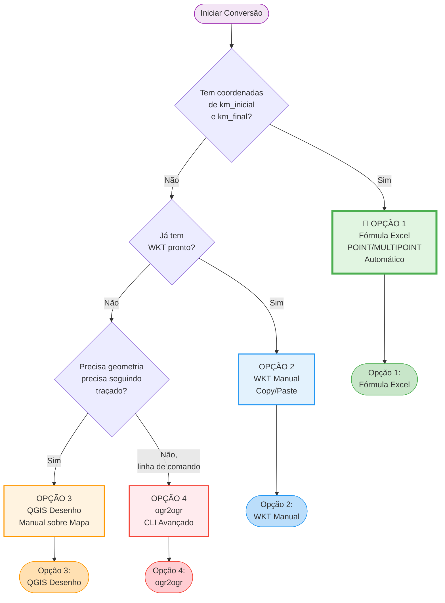

## **6. Conversão de Planilha para GeoJSON (Interface Gráfica)**

Este capítulo apresenta métodos práticos para converter planilhas Excel em arquivos GeoJSON válidos **usando ferramentas de interface gráfica** (QGIS) e edição manual.

**Público-alvo:** Usuários sem conhecimento de programação.

**📥 Download dos Templates:**
Os templates estão disponíveis no Portal de Dados Abertos da ARTESP:
[https://dadosabertos.artesp.sp.gov.br/dataset/programacao-de-obras](https://dadosabertos.artesp.sp.gov.br/dataset/programacao-de-obras)

- `template_lxx_conservacao_2026_r0.xlsx`
- `template_lxx_obras_2026_r0.xlsx`

---

## **Introdução e Visão Geral**

Este guia apresenta um processo passo a passo para usuários que preferem trabalhar com ferramentas visuais (Excel + QGIS) em vez de programação.

---

### **⚠️ IMPORTANTE: Requisitos de Precisão Geométrica da ARTESP**

A ARTESP adotou o formato GeoJSON especificamente para obter **geometrias realistas e precisas** dos serviços a serem executados.

**Requisitos obrigatórios:**

1. **Serviços lineares** (pavimentação, sinalização horizontal, barreiras) **DEVEM** usar **LineString** que **segue o traçado real da rodovia**.

2. **Serviços de área** (SAU, estacionamentos, áreas de intervenção) **DEVEM** usar **Polygon** representando a **área real** da intervenção.

3. **Serviços pontuais** (instalação de 1 equipamento em 1 local específico) podem usar **Point**.

**❌ NÃO SERÃO ACEITOS:**
- ❌ MULTIPOINT com apenas 2 pontos (início e fim) para representar serviços lineares
- ❌ LineString com apenas 2 pontos (linha reta) que não acompanha o traçado da rodovia
- ❌ Geometrias aproximadas ou simplificadas para serviços que requerem precisão

**✅ Implicações para escolha do método:**
- **Opção 1 (Fórmula Excel)**: Gera MULTIPOINT → **Aceita APENAS para serviços pontuais onde km_inicial = km_final**
- **Opção 2 (WKT Manual)**: Aceita **SE** o WKT contiver geometria completa e precisa
- **Opção 3 (QGIS Desenho Manual)**: **RECOMENDADO** para a maioria dos serviços lineares e de área
- **Opção 4 (ogr2ogr)**: Aceita se WKT de entrada já for completo e preciso

**💡 Recomendação:** Para a maioria dos serviços de conservação e obras, use a **Opção 3 (QGIS Desenho Manual)** para garantir conformidade com os requisitos da ARTESP.

---

**Passos do processo:**
1. Preparar a planilha Excel (seção 6.2)
2. Limpar, adicionar coluna ID e coordenadas (seção 6.3)
3. Escolher método de geometria - **4 opções**:
   - [**Opção 1**: Fórmula Excel automática]() (mais fácil)
   - [**Opção 2**: WKT manual]() (se já tem WKT)
   - [**Opção 3**: QGIS desenho manual]() (geometrias precisas) 🌟
   - [**Opção 4**: ogr2ogr CLI]() (avançado)
4. [Exportar para GeoJSON via QGIS]()
5. [Adicionar metadados e ajustar formato]()
6. [Validar o arquivo]()

---

## **Passo 1: Preparar a Planilha Excel**

1. **Baixe o template apropriado** do Portal de Dados Abertos:
   - Para conservação: `template_lxx_conservacao_2026_r0.xlsx`
   - Para obras: `template_lxx_obras_2026_r0.xlsx`

2. **Abra o arquivo no Excel ou LibreOffice Calc**

3. **Preencha seus dados seguindo as instruções do template**

**Exemplo de preenchimento para CONSERVAÇÃO:**

| lote | rodovia    | item  | detalhamento_servico              | unidade | quantidade | km_inicial | km_final | local                   | data_inicial | data_final | observacoes_gerais |
|:-----|:-----------|:------|:----------------------------------|:--------|:-----------|:-----------|:---------|:------------------------|:-------------|:-----------|:-------------------|
| L13  | SP0000280  | a.1.1 | Recuperação funcional do pavimento| km      | 5.25       | 22.500     | 27.750   | PISTA_NORTE;PISTA_SUL   | 2026-03-15   | 2026-07-20 | Período noturno    |
| L13  | SP0000330  | c.2.4 | Sinalização vertical              | un      | 15         | 132.100    | 138.500  | PISTA_NORTE             | 2026-02-01   | 2026-02-15 |                    |

**Exemplo de preenchimento para OBRAS:**

| lote | rodovia    | programa | item | subitem | detalhamento_servico           | unidade | quantidade | km_inicial | km_final | local              | data_inicial | data_final | observacoes_gerais |
|:-----|:-----------|:---------|:-----|:--------|:-------------------------------|:--------|:-----------|:-----------|:---------|:-------------------|:-------------|:-----------|:-------------------|
| L19  | SP0000280  | CAPEX    | 1    | 1       | Construção de Passarela        | un      | 1.000      | 25.300     | 25.300   | DISPOSITIVO        | 2026-01-20   | 2026-11-30 | Área comercial     |
| L07  | SPA000292  | REVIT    | 3    | 2       | Faixas adicionais de rolamento | km      | 12.400     | 110.200    | 122.601  | PISTA_LESTE        | 2025-09-01   | 2027-05-15 |                    |

**⚠️ Pontos de Atenção:**

- **Campo `local`**: Use **ponto e vírgula (`;`)** para separar múltiplos locais
  - Exemplo: `PISTA_NORTE;PISTA_SUL;CANTEIRO_CENTRAL`
- **Campo `lote`**: Use o formato **L + 2 dígitos**
  - Correto: `L01`, `L13`, `L22`
  - Errado: `L1`, `L133`, `1`
- **Datas**: Formato **YYYY-MM-DD**
  - Correto: `2026-03-15`
  - Errado: `15/03/2026`, `03-15-2026`
- **Campo `observacoes_gerais`**: Deixe em branco se não houver observações (será convertido para `null`)
- **Separador decimal**: Use **ponto (`.`)**, não vírgula
  - Correto: `125.500`
  - Errado: `125,500`

---

## **Passo 2: Limpar e Preparar a Planilha**

Antes de importar no QGIS, você precisa preparar a planilha:

**A. Remover Linhas de Cabeçalho e Exemplos:**

1. **Delete as linhas 1-5** do template (cabeçalho, instruções e exemplos)
2. A primeira linha deve conter apenas os nomes das colunas
3. A segunda linha em diante deve conter seus dados reais

**B. Remover Abas Não Utilizadas:**

1. Se o arquivo Excel tiver múltiplas abas, **delete todas** exceto a aba com seus dados
2. Renomeie a aba principal para "Dados" (opcional, mas recomendado)

**C. Adicionar Coluna ID:**

1. **Crie uma nova coluna chamada `id`** (primeira coluna, antes de `lote`)
2. Preencha com identificadores únicos sequenciais:
   - Para conservação: `conserva-001`, `conserva-002`, `conserva-003`, ...
   - Para obras: `obra-001`, `obra-002`, `obra-003`, ...
   - Ou simplesmente: `1`, `2`, `3`, ...

**D. Adicionar Colunas de Coordenadas:**

As coordenadas geográficas dos pontos inicial e final de cada serviço são necessárias para gerar as geometrias.

1. **Adicione 4 novas colunas** após a coluna `id`:
   - `lon_inicio` - Longitude do km_inicial
   - `lat_inicio` - Latitude do km_inicial
   - `lon_fim` - Longitude do km_final
   - `lat_fim` - Latitude do km_final

2. Preencha com as coordenadas em **graus decimais** no sistema **SIRGAS 2000 (EPSG:4674)**

**⚠️ IMPORTANTE: Separador Decimal**

As coordenadas **DEVEM usar PONTO (.) como separador decimal**, não vírgula.

- ✅ **Correto:** `-46.6333` ou `-23.5505`
- ❌ **Errado:** `-46,6333` ou `-23,5505`

**Como garantir formato correto:**

1. **Formate as células como Número:**
   - Selecione as colunas de coordenadas (lon_inicio, lat_inicio, lon_fim, lat_fim)
   - Clique direito → **Formatar Células**
   - Escolha **Número**
   - Configure **6 casas decimais**

2. **Se sua planilha já tem vírgulas**, use **Localizar e Substituir:**
   - Pressione `Ctrl+H`
   - Localizar: `,` (vírgula)
   - Substituir: `.` (ponto)
   - Clique em **Substituir Tudo** (aplique apenas nas colunas de coordenadas)

**Exemplo após limpeza (CONSERVAÇÃO):**

| id           | lon_inicio | lat_inicio | lon_fim  | lat_fim  | lote | rodovia   | item  | detalhamento_servico               | unidade | quantidade | km_inicial | km_final | local                 | data_inicial | data_final | observacoes_gerais |
|:-------------|:-----------|:-----------|:---------|:---------|:-----|:----------|:------|:-----------------------------------|:--------|:-----------|:-----------|:---------|:----------------------|:-------------|:-----------|:-------------------|
| conserva-001 | -46.6333   | -23.5505   | -46.6345 | -23.5515 | L13  | SP0000280 | a.1.1 | Recuperação funcional do pavimento | km      | 5.25       | 22.500     | 27.750   | PISTA_NORTE;PISTA_SUL | 2026-03-15   | 2026-07-20 | Período noturno    |
| conserva-002 | -47.0613   | -22.9054   | -47.0613 | -22.9054 | L13  | SP0000330 | c.2.4 | Sinalização vertical               | un      | 15         | 132.100    | 138.500  | PISTA_NORTE           | 2026-02-01   | 2026-02-15 |                    |

---

## **Próximos Passos: Escolha seu Método**

Agora que seus dados estão preparados, escolha **uma das quatro opções** para gerar as geometrias:

**📊 Tabela Comparativa:**

| Opção | Método | Melhor Para | Tempo | Dificuldade | Geometrias Geradas | ✅ Aceito ARTESP? |
|:------|:-------|:------------|:------|:------------|:-------------------|:-----------------|
| **[1]()** | Fórmula Excel (automática) | Serviços pontuais (km_inicial = km_final) | 5-10 min | ⭐ Muito Fácil | POINT ou MULTIPOINT | ⚠️ **Apenas POINT** (serviços pontuais). MULTIPOINT **NÃO é aceito** para lineares/área |
| **[2]()** | WKT Manual (cópia/edição) | Quando já tem WKT completo de outra fonte | 15-30 min | ⭐⭐ Fácil | Qualquer tipo | ✅ SE o WKT for completo e preciso |
| **[3]()** 🌟 | **QGIS Desenho Manual** | **Serviços lineares e de área** (RECOMENDADO) | 30-60 min | ⭐⭐⭐ Média | **LineString/Polygon precisos** | ✅ **SIM - Recomendado** |
| **[4]()** | ogr2ogr (CLI avançado) | Conversão de WKT existente completo | 10-20 min | ⭐⭐⭐⭐ Alta | Conversão de WKT | ✅ SE o WKT de entrada for completo |

**⚠️ ATENÇÃO - Requisitos ARTESP:**
- **Serviços lineares** (pavimentação, sinalização, barreiras) → Use [**Opção 3**]() (QGIS Desenho Manual)
- **Serviços de área** (SAU, estacionamentos) → Use [**Opção 3**]() (QGIS Desenho Manual)
- **Serviços pontuais** (1 equipamento em 1 local) → Pode usar [**Opção 1**]() (Fórmula Excel com POINT)

**💡 Recomendação:** Para a **maioria dos serviços de conservação e obras**, use a [**Opção 3**]() (QGIS Desenho Manual) para garantir geometrias precisas que seguem o traçado real da rodovia.

---

**📌 Navegação:**

- [➡️ Opção 1: Fórmula Excel/Calc]()
- [➡️ Opção 2: WKT Manual]()
- [➡️ Opção 3: QGIS Desenho Manual]() 🌟 Recomendado
- [➡️ Opção 4: ogr2ogr CLI]()
