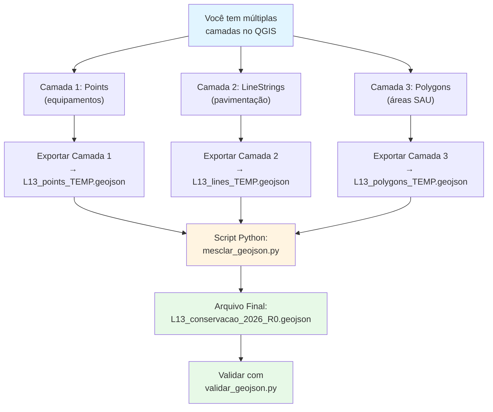

## **6.5 Passo 4: Exportar para GeoJSON (QGIS)**

**📋 Este passo se aplica a:**
- ✅ [**Opção 1** (Fórmula Excel)]() - Você importou CSV com WKT no QGIS
- ✅ [**Opção 2** (WKT Manual)]() - Você importou CSV com WKT no QGIS
- ✅ [**Opção 3** (QGIS Desenho Manual)]() - Você desenhou geometrias em GeoPackage/Shapefile
- ❌ [**Opção 4** (ogr2ogr)]() - Pule direto para **Seção 6.6**

---

Agora você tem uma camada com geometrias no QGIS e precisa exportá-la como GeoJSON.

---

## **A. Tratamento de Múltiplas Camadas com Geometrias Diferentes**

**📋 Esta seção se aplica a você SE:**
- ✅ Criou **múltiplas camadas** no QGIS (Point, LineString, Polygon separados)
- ✅ Seus serviços têm **tipos de geometria diferentes**
- ✅ Precisa combinar essas camadas em **um único arquivo GeoJSON**

**❌ Se você tem apenas UMA camada:**
- Pule esta seção e vá direto para [Seção B - Exportar](#b-exportar)

---

### **Por que preciso combinar arquivos?**

**Limitação do QGIS:**
- Cada camada GeoPackage/Shapefile suporta **apenas UM tipo de geometria**
- Se você tem Point + LineString + Polygon, precisou criar 3 camadas separadas
- Ao exportar, o QGIS gera **UM arquivo GeoJSON por camada**

**Exigência do Schema:**
- O arquivo final deve ser **UM ÚNICO GeoJSON** contendo TODAS as features
- O schema permite geometrias mistas (Point, LineString, Polygon, MultiPoint) no mesmo FeatureCollection

**Solução:**
- Exportar cada camada separadamente
- Combinar os arquivos usando o script `mesclar_geojson.py`

---

### **Fluxograma do Processo**



---

### **Passo a Passo: Exportar e Combinar**

#### **1. Exportar cada camada separadamente**

Para cada camada que você criou (Points, LineStrings, Polygons):

1. **Selecione a camada** no painel de camadas
2. **Botão direito** → **"Exportar → Salvar Feições Como..."**
3. **Configure:**
   - **Formato**: GeoJSON
   - **Nome do arquivo**: Use sufixo identificando o tipo
     - `L13_conservacao_points_TEMP.geojson`
     - `L13_conservacao_lines_TEMP.geojson`
     - `L13_conservacao_polygons_TEMP.geojson`
   - **SRC**: EPSG:4674 - SIRGAS 2000
   - **Precisão**: 6 casas decimais
   - **Codificação**: UTF-8
4. Clique **OK**

💡 **Dica:** Use sufixo `_TEMP` para indicar que são arquivos temporários que serão mesclados.

**Repita para todas as camadas.**

---

#### **2. Combinar os arquivos com o script Python**

**Requisitos:**
- Python 3.6+ instalado
- Script `mesclar_geojson.py` (disponível em `/scripts` do projeto)

**Comando:**

```bash
python scripts/mesclar_geojson.py \
    L13_conservacao_points_TEMP.geojson \
    L13_conservacao_lines_TEMP.geojson \
    L13_conservacao_polygons_TEMP.geojson \
    -o L13_conservacao_2026_R0.geojson
```

**Ajuste conforme seu caso:**
- Adicione ou remova arquivos conforme necessário
- Use o nome final correto (`L[número]_conservacao_2026_R0.geojson` ou `L[número]_obras_2026_R0.geojson`)

**O que o script faz:**
- ✅ Combina todas as features em um único FeatureCollection
- ✅ Verifica IDs duplicados e emite avisos
- ✅ Adiciona CRS (EPSG:4674)
- ✅ Adiciona metadata (schema_version: R0, data_geracao)
- ✅ Preserva todos os atributos das features originais

**Exemplo de saída:**

```
======================================================================
  Mesclagem de Arquivos GeoJSON
======================================================================

📂 Arquivos de entrada: 3

[1/3] Processando: L13_conservacao_points_TEMP.geojson
------------------------------------------------------------
✅ 15 features extraídas:
   - Point: 15

[2/3] Processando: L13_conservacao_lines_TEMP.geojson
------------------------------------------------------------
✅ 8 features extraídas:
   - LineString: 8

[3/3] Processando: L13_conservacao_polygons_TEMP.geojson
------------------------------------------------------------
✅ 3 features extraídas:
   - Polygon: 3

======================================================================
📊 Resumo da Mesclagem
======================================================================
Total de features: 26
Tipos de geometria:
  - LineString: 8
  - Point: 15
  - Polygon: 3

Verificando unicidade dos IDs...
IDs únicos: 26

✅ Arquivo mesclado salvo com sucesso!
📁 Arquivo de saída: L13_conservacao_2026_R0.geojson
📏 Tamanho: 45.2 KB

======================================================================
✅ Próximo passo: Validar com validar_geojson.py
======================================================================
```

---

#### **3. Deletar arquivos temporários**

Após confirmar que o arquivo mesclado foi criado corretamente:

```bash
rm L13_conservacao_points_TEMP.geojson
rm L13_conservacao_lines_TEMP.geojson
rm L13_conservacao_polygons_TEMP.geojson
```

Ou no Windows:
```cmd
del L13_conservacao_points_TEMP.geojson
del L13_conservacao_lines_TEMP.geojson
del L13_conservacao_polygons_TEMP.geojson
```

---

#### **4. Prosseguir para ajustes e validação**

Agora você tem **UM ÚNICO arquivo GeoJSON** contendo todas as features.

➡️ Continue para [Seção B - Remover Colunas Auxiliares](#b-remover-colunas-auxiliares-se-necessário) se necessário.

➡️ Ou pule direto para [Seção 6.6 - Adicionar Metadados](#66-passo-5-adicionar-metadados-e-ajustar-formato).

---

### **⚠️ Problemas Comuns**

**IDs duplicados entre camadas:**
- Se o script reportar IDs duplicados, verifique se você não repetiu IDs entre as camadas
- Cada feature precisa ter um ID único em TODO o arquivo final
- Corrija no QGIS (tabela de atributos) e re-exporte

**Erro "File not found":**
- Certifique-se de estar no diretório correto
- Use caminhos absolutos ou relativos corretos
- No Windows, use barras duplas `\\` ou barras normais `/`

**Script não encontrado:**
- Baixe o script do Portal de Dados Abertos da ARTESP
- Ou consulte [Seção 7.8]() para o código completo

---

### **📘 Documentação Técnica do Script**

Para detalhes técnicos, código-fonte completo e exemplos adicionais, consulte:

➡️ [Capítulo 7, Seção 7.8 - Mesclagem de Arquivos GeoJSON]()

---

## **B. Exportar:**

**📋 Esta seção se aplica se você tem UMA ÚNICA camada.**

Se você passou pela Seção A acima e já tem o arquivo mesclado, **pule esta seção**.

---

1. **Selecione a camada** no painel de camadas (a que contém suas geometrias finais)

   ⚠️ **Tem MÚLTIPLAS camadas (Point/LineString/Polygon separados)?**
   → Volte para [Seção A - Múltiplas Camadas](#a-tratamento-de-múltiplas-camadas-com-geometrias-diferentes) acima!

   Esta seção B é apenas para quem tem UMA única camada.

2. Clique com **botão direito** na camada → **"Exportar → Salvar Feições Como..."**

3. **Configure a exportação:**
   - **Formato**: **GeoJSON**
   - **Nome do arquivo**: `L13_conservacao_2026_R0.geojson` (ajuste conforme seu lote e tipo)
     - Para conservação: `L[número]_conservacao_2026_R0.geojson`
     - Para obras: `L[número]_obras_2026_R0.geojson`
   - **SRC**: **EPSG:4674 - SIRGAS 2000**
   - **Precisão de coordenadas**: **6** casas decimais
   - **Codificação**: UTF-8

4. Clique em **"OK"**

5. **Verifique:** Um arquivo `.geojson` deve ser criado no local especificado

---

## **B. Remover Colunas Auxiliares (se necessário):**

Se você usou colunas auxiliares (`lat_ref`, `lon_ref`, `lon_inicio`, `lat_inicio`, `lon_fim`, `lat_fim`, ou `wkt`) durante o processo, essas colunas podem ter sido exportadas como propriedades. Você precisa removê-las do GeoJSON final.

**Como remover:**

1. **Abra o arquivo GeoJSON** em um editor de texto:
   - VS Code (recomendado)
   - Notepad++
   - Sublime Text

2. **Localize as propriedades auxiliares** dentro de cada feature:
   ```json
   "properties": {
     "id": "conserva-001",
     "lote": "L13",
     "lon_inicio": -46.6333,    ← REMOVER
     "lat_inicio": -23.5505,     ← REMOVER
     "lon_fim": -46.6345,        ← REMOVER
     "lat_fim": -23.5515,        ← REMOVER
     "wkt": "MULTIPOINT(...)",   ← REMOVER
     "rodovia": "SP0000280",
     ...
   }
   ```

3. **Delete essas linhas** para cada feature

4. **Salve o arquivo**

**💡 Dica:** Se você tem muitas features, use a funcionalidade de "Find & Replace" do VS Code:
- Procure por: `"lon_inicio":.*,\n` ou `"wkt":.*,\n`
- Substitua por: (vazio)
- Repita para cada coluna auxiliar

---

## **6.6 Passo 5: Adicionar Metadados e Ajustar Formato**

Abra o arquivo GeoJSON em um editor de texto e faça os seguintes ajustes.

**NOTA:** Se você usou [**Opção 4 (ogr2ogr)**](), você também precisa remover o campo `name` e adicionar os campos `crs` e `metadata` conforme descrito na Opção 4, seção E.

---

### **6.6.1 Converter Campo `local` de String para Array (Obrigatório)**

O campo `local` no GeoJSON exportado estará como string delimitada por `;`. Você precisa convertê-lo para array.

**De:**
```json
"local": "PISTA_NORTE;PISTA_SUL"
```

**Para:**
```json
"local": ["PISTA_NORTE", "PISTA_SUL"]
```

Escolha **uma das opções** abaixo para fazer essa conversão:

---

#### **Opção 1: Edição Manual** (para poucos registros)

Se você tem poucos registros, edite manualmente no editor de texto:

1. Localize cada ocorrência de `"local": "..."`
2. Substitua manualmente pela sintaxe de array

**Vantagens:** Simples, não requer ferramentas adicionais
**Desvantagens:** Trabalhoso para muitos registros

---

#### **Opção 2: Busca e Substituição com Regex no VS Code** (recomendado)

Use expressões regulares no VS Code para conversão semiautomática:

1. Abra o arquivo GeoJSON no **VS Code**
2. Pressione `Ctrl+H` (ou `Cmd+H` no Mac) para abrir Find & Replace
3. Clique no ícone `.*` para ativar **Regex**
4. Configure:
   - **Find**: `"local": "([^"]+)"`
   - **Replace**: `"local": "$1"`
5. **Revise manualmente** cada ocorrência e ajuste:
   - Para `PISTA_NORTE;PISTA_SUL` → digite `["PISTA_NORTE", "PISTA_SUL"]`
   - Para `PISTA_NORTE` → digite `["PISTA_NORTE"]`
   - Para campo vazio → digite `[]`

**Vantagens:** Mais rápido que manual, com controle visual
**Desvantagens:** Requer ajuste manual de cada substituição

---

#### **Opção 3: Script Python Automático** (mais confiável)

Use um script Python para conversão automática e segura:

**Crie um arquivo chamado `converter_local.py`:**

```python
import json
import sys

def converter_local_para_array(arquivo_geojson):
    """
    Converte o campo 'local' de string delimitada por ';' para array.
    """
    print(f"Processando arquivo: {arquivo_geojson}")

    # Ler o arquivo GeoJSON
    with open(arquivo_geojson, 'r', encoding='utf-8') as f:
        data = json.load(f)

    # Processar cada feature
    count = 0
    for feature in data.get('features', []):
        local_value = feature['properties'].get('local', '')

        if isinstance(local_value, str):
            if local_value.strip():
                # Converter string delimitada em array
                feature['properties']['local'] = [
                    loc.strip() for loc in local_value.split(';') if loc.strip()
                ]
            else:
                # String vazia → array vazio
                feature['properties']['local'] = []
            count += 1
        # Se já for array, manter como está

    # Salvar arquivo modificado
    with open(arquivo_geojson, 'w', encoding='utf-8') as f:
        json.dump(data, f, ensure_ascii=False, indent=2)

    print(f"✅ Convertidos {count} campos 'local' para array.")
    print(f"✅ Arquivo atualizado: {arquivo_geojson}")

if __name__ == "__main__":
    if len(sys.argv) != 2:
        print("Uso: python converter_local.py <arquivo.geojson>")
        print("Exemplo: python converter_local.py L13_conservacao_2026_R0.geojson")
        sys.exit(1)

    converter_local_para_array(sys.argv[1])
```

**Como usar:**

```bash
python converter_local.py L13_conservacao_2026_R0.geojson
```

**Vantagens:** Automático, confiável, processa qualquer quantidade de registros
**Desvantagens:** Requer Python instalado

---

#### **Opção 4: jq (Ferramenta CLI)** (para usuários avançados)

Se você tem `jq` instalado (ferramenta de processamento JSON via linha de comando):

**Instalação do jq:**
- **Linux**: `sudo apt install jq` ou `sudo pacman -S jq`
- **Mac**: `brew install jq`
- **Windows**: Baixe em [https://stedolan.github.io/jq/](https://stedolan.github.io/jq/)

**Comando:**

```bash
jq '.features[].properties.local |= (
  if type == "string" then
    split(";") | map(gsub("^\\s+|\\s+$"; "")) | map(select(length > 0))
  else
    .
  end
)' arquivo.geojson > arquivo_convertido.geojson
```

**Ou sobrescrever o arquivo original:**

```bash
jq '.features[].properties.local |= (
  if type == "string" then
    split(";") | map(gsub("^\\s+|\\s+$"; "")) | map(select(length > 0))
  else
    .
  end
)' arquivo.geojson | sponge arquivo.geojson
```

*(requer `moreutils` para o comando `sponge`)*

**Vantagens:** Extremamente rápido, ideal para arquivos grandes
**Desvantagens:** Requer instalação e conhecimento de jq

---

**💡 Recomendação:**
- **Poucos registros (< 10)**: Use **Opção 1** (manual)
- **Registros médios (10-100)**: Use **Opção 2** (Regex no VS Code)
- **Muitos registros (> 100)**: Use **Opção 3** (Script Python) ou **Opção 4** (jq)

---

### **6.6.2 Adicionar Metadados ao Arquivo**

Logo após a linha `"type": "FeatureCollection",`, adicione:

```json
"crs": {
  "type": "name",
  "properties": {
    "name": "urn:ogc:def:crs:EPSG::4674"
  }
},
"metadata": {
  "schema_version": "R0",
  "data_geracao": "2025-11-08T10:30:00-03:00"
},
```

**Ajuste a data em `data_geracao`** para a data/hora atual.

**Ferramentas de edição JSON recomendadas:**
- **VS Code** com extensão "JSON Tools"
- **Notepad++** com plugin JSON Viewer
- **JSONLint** (online): [https://jsonlint.com/](https://jsonlint.com/)

---

## **6.7 Passo 6: Validar o Arquivo**

Após criar e ajustar o GeoJSON, **valide-o** usando o script fornecido pela ARTESP:

```bash
# Baixe o script validar_geojson.py e os schemas do Portal de Dados Abertos
# Execute:
python validar_geojson.py schemas/conserva.schema.r0.json L13_conservacao_2026_R0.geojson
```

**Ou use ferramentas online:**
- [GeoJSONLint](https://geojsonlint.com/)
- [JSON Schema Validator](https://www.jsonschemavalidator.net/)

O script verificará:
- ✅ Conformidade com o schema
- ✅ Unicidade dos IDs
- ✅ Formato dos campos
- ✅ CRS correto
- ✅ Geometrias válidas

---

**🎉 Parabéns!** Se a validação passou, seu arquivo GeoJSON está pronto para envio à ARTESP.
