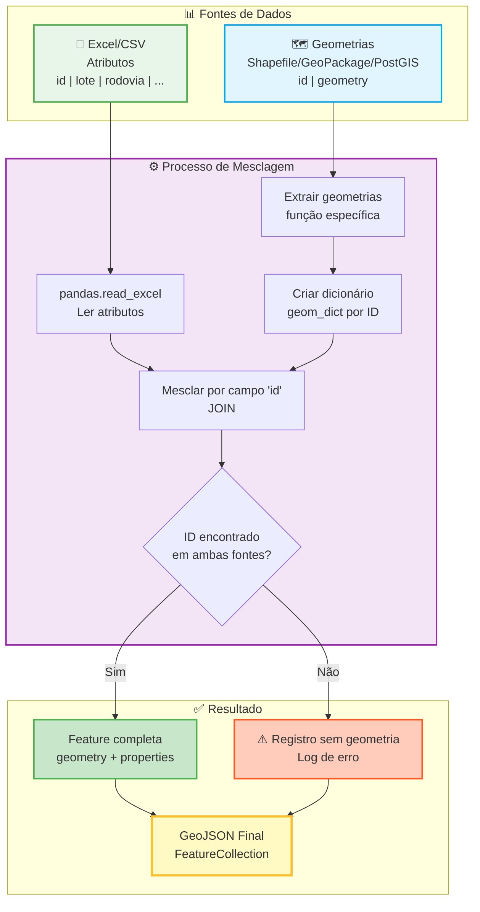

## **7. Conversão Programática para GeoJSON (Scripts e Automação)**

Este capítulo apresenta métodos programáticos para converter planilhas e outras fontes de dados em arquivos GeoJSON válidos, usando **Python e ferramentas de linha de comando**.

**Público-alvo:** Desenvolvedores, analistas com conhecimento de Python/SQL, profissionais que preferem automação.

---

## **7.1 Introdução**

**Quando usar métodos programáticos:**
- Você tem experiência com Python ou programação
- Precisa processar grandes volumes de dados
- Deseja automatizar o processo de conversão
- Tem dados em múltiplas fontes (banco de dados, APIs, shapefiles, etc.)
- Precisa integrar a conversão em pipelines de dados existentes

**Requisitos técnicos:**
- Python 3.8+ instalado
- Bibliotecas: `pandas`, `openpyxl`, `shapely`, `geopandas` (conforme necessidade)
- Para PostGIS: `psycopg2`
- Para APIs: `requests`

**Instalação das bibliotecas básicas:**

```bash
pip install pandas openpyxl shapely geopandas
```

---

## **7.2 Conversão de Planilha Excel/CSV com Python**

O script em Python a seguir converte automaticamente a planilha Excel em GeoJSON, seguindo as regras do schema.

**Passo 1: Instalação das bibliotecas necessárias**

```bash
pip install pandas openpyxl
```

**Passo 2: Script de Conversão (Python 3.8+)**

> **Nota:** Este script converte a planilha Excel para GeoJSON, processando o campo `local` e gerando IDs únicos automaticamente. A geometria deve ser adicionada separadamente (ver Seção 7.3).

```python
import pandas as pd
import json
from datetime import datetime
import sys

def converter_planilha_para_geojson(
    arquivo_planilha,
    arquivo_geojson_saida,
    tipo_template,  # 'conservacao' ou 'obras'
    lote,  # Ex: 'L13'
    aba_planilha="Dados"
):
    """
    Converte uma planilha Excel/CSV para GeoJSON conforme schema R0.

    - Processa campo 'local' (separado por ';') para array
    - Gera campo 'id' único automaticamente
    - Configura metadados e CRS corretamente

    A geometria deve ser adicionada separadamente usando QGIS ou outro método.
    """

    print(f"Lendo planilha: {arquivo_planilha}")
    try:
        if arquivo_planilha.endswith('.xlsx'):
            # Ignora as 5 primeiras linhas do template (cabeçalho + instruções + exemplos)
            df = pd.read_excel(arquivo_planilha, sheet_name=aba_planilha, skiprows=5)
        elif arquivo_planilha.endswith('.csv'):
            df = pd.read_csv(arquivo_planilha, skiprows=5)
        else:
            raise ValueError("Formato não suportado (use .xlsx ou .csv)")
    except Exception as e:
        print(f"Erro ao ler planilha: {e}")
        return

    # Remover linhas completamente vazias
    df = df.dropna(how='all')

    print(f"Encontradas {len(df)} linhas de dados.")

    features = []

    for idx, row in df.iterrows():
        # Gerar ID único (formato: tipo-lote-sequencial)
        id_feature = f"{tipo_template[:8]}-{lote}-{str(idx+1).zfill(3)}"

        # Processar campo 'local' (separado por ';' no Excel → array no JSON)
        local_value = row.get('local', '')
        if pd.notna(local_value) and local_value:
            # Dividir por ';' e remover espaços
            local_array = [loc.strip() for loc in str(local_value).split(';') if loc.strip()]
        else:
            local_array = []

        # Construir properties
        properties = {
            'id': id_feature,
            'lote': row.get('lote'),
            'rodovia': row.get('rodovia'),
            'detalhamento_servico': row.get('detalhamento_servico'),
            'unidade': row.get('unidade'),
            'quantidade': row.get('quantidade'),
            'km_inicial': row.get('km_inicial'),
            'km_final': row.get('km_final'),
            'local': local_array,
            'data_inicial': row.get('data_inicial'),
            'data_final': row.get('data_final'),
            'observacoes_gerais': row.get('observacoes_gerais')
        }

        # Adicionar campos específicos por tipo
        if tipo_template == 'conservacao':
            properties['item'] = row.get('item')
        elif tipo_template == 'obras':
            properties['programa'] = row.get('programa')
            properties['item'] = int(row.get('item')) if pd.notna(row.get('item')) else None
            properties['subitem'] = int(row.get('subitem')) if pd.notna(row.get('subitem')) else None

        # Converter datas para string no formato YYYY-MM-DD
        for campo_data in ['data_inicial', 'data_final']:
            if pd.notna(properties[campo_data]):
                if isinstance(properties[campo_data], pd.Timestamp):
                    properties[campo_data] = properties[campo_data].strftime('%Y-%m-%d')
                else:
                    # Se já for string, garantir formato correto
                    properties[campo_data] = str(properties[campo_data])

        # Converter NaN/None para null JSON
        properties_limpas = {}
        for k, v in properties.items():
            if pd.isna(v) or (isinstance(v, str) and v.strip() == ''):
                properties_limpas[k] = None
            else:
                properties_limpas[k] = v

        # Criar feature (geometria None - deve ser adicionada depois)
        feature = {
            "type": "Feature",
            "geometry": None,  # Geometria deve ser adicionada com QGIS ou outro método
            "properties": properties_limpas
        }
        features.append(feature)

    # Estrutura GeoJSON final
    geojson_final = {
        "type": "FeatureCollection",
        "crs": {
            "type": "name",
            "properties": { "name": "urn:ogc:def:crs:EPSG::4674" }
        },
        "metadata": {
            "schema_version": "R0",
            "data_geracao": datetime.now().strftime('%Y-%m-%dT%H:%M:%S-03:00')
        },
        "features": features
    }

    # Salvar arquivo
    with open(arquivo_geojson_saida, 'w', encoding='utf-8') as f:
        json.dump(geojson_final, f, ensure_ascii=False, indent=2)

    print(f"✅ Arquivo '{arquivo_geojson_saida}' criado com {len(features)} features.")
    print(f"⚠️  As geometrias estão NULL. Use uma das opções da Seção 7.3 para adicionar geometrias.")
    print(f"⚠️  Valide o arquivo antes de enviar: python validar_geojson.py")


# --- Como usar ---
if __name__ == "__main__":
    if len(sys.argv) != 5:
        print("Uso: python converter.py <arquivo_excel> <conservacao|obras> <lote> <arquivo_saida>")
        print("Exemplo: python converter.py template_lxx_conservacao_2026_r0.xlsx conservacao L13 L13_conservacao_2026_R0.geojson")
        sys.exit(1)

    arquivo_entrada = sys.argv[1]
    tipo = sys.argv[2]
    lote = sys.argv[3]
    arquivo_saida = sys.argv[4]

    if tipo not in ['conservacao', 'obras']:
        print("Erro: O tipo deve ser 'conservacao' ou 'obras'")
        sys.exit(1)

    converter_planilha_para_geojson(
        arquivo_planilha=arquivo_entrada,
        arquivo_geojson_saida=arquivo_saida,
        tipo_template=tipo,
        lote=lote,
        aba_planilha="Dados"
    )
```

**Passo 3: Como executar o script**

```bash
# Para arquivo de conservação do lote L13
python converter.py template_lxx_conservacao_2026_r0.xlsx conservacao L13 L13_conservacao_2026_R0.geojson

# Para arquivo de obras do lote L22
python converter.py template_lxx_obras_2026_r0.xlsx obras L22 L22_obras_2026_R0.geojson
```

**O que o script faz:**

1. ✅ Lê a planilha Excel (pulando linhas de cabeçalho/exemplos)
2. ✅ Gera IDs únicos automaticamente (formato: `conservacao-L13-001`, `obra-L22-001`)
3. ✅ Converte campo `local` de string delimitada para array
4. ✅ Formata datas para YYYY-MM-DD
5. ✅ Configura CRS como `urn:ogc:def:crs:EPSG::4674`
6. ✅ Adiciona metadados corretos
7. ⚠️ Cria geometrias NULL (devem ser adicionadas - ver Seção 7.3)

---

## **7.3 Extração de Geometrias de Múltiplas Fontes**

Esta seção apresenta métodos para adicionar geometrias ao GeoJSON a partir de diferentes fontes de dados.

### **7.3.1 Fonte: Planilha com Coordenadas (lat/lon)**

Se sua planilha tem colunas `lat` e `lon`, você pode criar geometrias Point automaticamente:

```python
import pandas as pd
from shapely.geometry import Point, mapping
import json

def criar_point_de_planilha(df):
    """
    Cria geometrias Point a partir de colunas lat/lon.

    Parâmetros:
        df: DataFrame pandas com colunas 'lat' e 'lon'

    Retorna:
        Lista de features GeoJSON com geometrias Point
    """
    features = []

    for idx, row in df.iterrows():
        # Criar geometria Point
        point = Point(row['lon'], row['lat'])

        # Criar feature
        feature = {
            "type": "Feature",
            "geometry": mapping(point),  # Converte Shapely para GeoJSON
            "properties": {
                "id": row['id'],
                "lote": row['lote'],
                "rodovia": row['rodovia'],
                "detalhamento_servico": row['detalhamento_servico'],
                # ... adicionar outros campos conforme necessário
            }
        }
        features.append(feature)

    return features

# Exemplo de uso
df = pd.read_excel('dados_com_latlon.xlsx')
features = criar_point_de_planilha(df)
```

---

### **7.3.2 Fonte: Planilha com WKT**

Se sua planilha tem uma coluna `wkt` com geometrias em formato WKT:

```python
from shapely import wkt
from shapely.geometry import mapping
import pandas as pd

def criar_geometria_de_wkt(df):
    """
    Cria geometrias a partir de coluna WKT.

    Parâmetros:
        df: DataFrame pandas com coluna 'wkt'

    Retorna:
        Lista de features GeoJSON
    """
    features = []

    for idx, row in df.iterrows():
        # Parsear WKT para objeto Shapely
        geom = wkt.loads(row['wkt'])

        # Criar feature
        feature = {
            "type": "Feature",
            "geometry": mapping(geom),  # Converte Shapely para GeoJSON
            "properties": {
                "id": row['id'],
                "lote": row['lote'],
                "rodovia": row['rodovia'],
                "detalhamento_servico": row['detalhamento_servico'],
                # ... adicionar outros campos
            }
        }
        features.append(feature)

    return features

# Exemplo
df = pd.read_csv('dados_com_wkt.csv')
features = criar_geometria_de_wkt(df)
```

---

### **7.3.3 Fonte: Banco de Dados PostGIS**

Para extrair geometrias diretamente de um banco de dados PostGIS:

```mermaid
flowchart LR
    subgraph DB["🗄️ PostGIS Database"]
        Table[(Tabela com<br/>geometrias)]
    end

    subgraph Python["🐍 Python Script"]
        Conn[psycopg2.connect<br/>Conexão]
        Query[SQL Query<br/>ST_AsGeoJSON]
        Parse[json.loads<br/>Parse geometria]
        Build[Construir<br/>Features]
    end

    subgraph Output["📄 Arquivo GeoJSON"]
        JSON["FeatureCollection<br/>features: [...]"]
        File[L13_conservacao_2026_R0.geojson]
    end

    Table -->|SELECT id, ST_AsGeoJSON| Conn
    Conn --> Query
    Query -->|rows| Parse
    Parse --> Build
    Build -->|features list| JSON
    JSON -->|json.dump| File

    style DB fill:#e8f5e9,stroke:#4caf50,stroke-width:2px
    style Python fill:#e3f2fd,stroke:#2196f3,stroke-width:2px
    style Output fill:#fff3e0,stroke:#ff9800,stroke-width:2px
    style Table fill:#c8e6c9
    style File fill:#ffe0b2
```



```python
import psycopg2
import json

def extrair_de_postgis(query, connection_params):
    """
    Extrai geometrias de um banco PostGIS.

    Parâmetros:
        query: SQL com ST_AsGeoJSON(geom) AS geom_json
        connection_params: dict com host, database, user, password

    Retorna:
        Lista de features GeoJSON
    """
    # Conectar ao banco
    conn = psycopg2.connect(**connection_params)
    cursor = conn.cursor()

    # Executar query
    cursor.execute(query)
    rows = cursor.fetchall()

    features = []
    for row in rows:
        # Estrutura depende da query, este é um exemplo genérico
        feature = {
            "type": "Feature",
            "geometry": json.loads(row[1]),  # geom_json já está em formato GeoJSON
            "properties": {
                "id": row[0],
                "lote": row[2],
                "rodovia": row[3],
                "detalhamento_servico": row[4],
                "unidade": row[5],
                "quantidade": row[6],
                "km_inicial": row[7],
                "km_final": row[8],
                "local": row[9].split(';') if row[9] else [],  # Converter string para array
                "data_inicial": str(row[10]),
                "data_final": str(row[11]),
                "observacoes_gerais": row[12]
            }
        }
        features.append(feature)

    cursor.close()
    conn.close()

    return features

# Exemplo de uso
conn_params = {
    'host': 'localhost',
    'database': 'rodovias',
    'user': 'usuario',
    'password': 'senha'
}

query = """
SELECT
    id,
    ST_AsGeoJSON(ST_Transform(geom, 4674)) AS geom_json,
    lote,
    rodovia,
    detalhamento_servico,
    unidade,
    quantidade,
    km_inicial,
    km_final,
    local,
    data_inicial,
    data_final,
    observacoes_gerais
FROM obras_conservacao
WHERE ano_programacao = 2026
  AND lote = 'L13'
"""

features = extrair_de_postgis(query, conn_params)
```

**Dicas para PostGIS:**
- Use `ST_AsGeoJSON(geom)` para exportar geometria diretamente em formato GeoJSON
- Use `ST_Transform(geom, 4674)` se a geometria estiver em outro CRS
- Filtre dados no SQL para melhor performance (WHERE, LIMIT)
- Para grandes volumes, use `LIMIT` e `OFFSET` para processar em lotes

**Instalação do psycopg2:**

```bash
pip install psycopg2-binary
```

---

### **7.3.4 Fonte: GeoPackage**

GeoPackage (.gpkg) é um formato geoespacial baseado em SQLite:

```python
import geopandas as gpd
import json

def extrair_de_geopackage(gpkg_path, layer_name):
    """
    Extrai geometrias de um arquivo GeoPackage.

    Parâmetros:
        gpkg_path: Caminho para o arquivo .gpkg
        layer_name: Nome da camada a ser extraída

    Retorna:
        Lista de features GeoJSON
    """
    # Ler camada do GeoPackage
    gdf = gpd.read_file(gpkg_path, layer=layer_name)

    # Reprojetar para EPSG:4674 se necessário
    if gdf.crs.to_epsg() != 4674:
        print(f"Reprojetando de {gdf.crs} para EPSG:4674")
        gdf = gdf.to_crs(epsg=4674)

    # Converter para GeoJSON features
    features = []
    for idx, row in gdf.iterrows():
        feature = {
            "type": "Feature",
            "geometry": json.loads(gpd.GeoSeries([row.geometry]).to_json())['features'][0]['geometry'],
            "properties": {
                "id": row['id'],
                "lote": row['lote'],
                "rodovia": row['rodovia'],
                "detalhamento_servico": row['detalhamento_servico'],
                "unidade": row['unidade'],
                "quantidade": row['quantidade'],
                "km_inicial": row['km_inicial'],
                "km_final": row['km_final'],
                "local": row['local'].split(';') if isinstance(row['local'], str) else row['local'],
                "data_inicial": str(row['data_inicial']),
                "data_final": str(row['data_final']),
                "observacoes_gerais": row['observacoes_gerais']
            }
        }
        features.append(feature)

    return features

# Exemplo de uso
features = extrair_de_geopackage('dados_rodovias.gpkg', 'conservacao_2026')
```

**Instalação do GeoPandas:**

```bash
pip install geopandas
```

---

### **7.3.5 Fonte: Shapefile**

Para extrair geometrias de um Shapefile:

```python
import geopandas as gpd
import json

def extrair_de_shapefile(shp_path):
    """
    Extrai geometrias de um Shapefile.

    Parâmetros:
        shp_path: Caminho para o arquivo .shp

    Retorna:
        Lista de features GeoJSON
    """
    # Ler shapefile
    gdf = gpd.read_file(shp_path)

    # Reprojetar para EPSG:4674
    if gdf.crs.to_epsg() != 4674:
        print(f"Reprojetando de {gdf.crs} para EPSG:4674")
        gdf = gdf.to_crs(epsg=4674)

    # Converter para GeoJSON features
    features = json.loads(gdf.to_json())['features']

    # Processar properties para adequar ao schema
    for feature in features:
        # Processar campo 'local' se for string delimitada
        if 'local' in feature['properties']:
            local_str = feature['properties']['local']
            if isinstance(local_str, str) and ';' in local_str:
                feature['properties']['local'] = [
                    loc.strip() for loc in local_str.split(';') if loc.strip()
                ]

        # Garantir que campos obrigatórios existam
        # Adicionar validações conforme necessário

    return features

# Exemplo
features = extrair_de_shapefile('conservacao_2026.shp')
```

**Nota:** Shapef

iles têm limitações:
- Nomes de campos limitados a 10 caracteres
- Não suportam arrays (campo `local` precisará ser string delimitada)
- Encoding pode ser problemático (usar `encoding='utf-8'` ou `encoding='latin1'`)

---

### **7.3.6 Fonte: API REST/Web Service**

Para extrair dados de APIs REST:

```python
import requests
import json

def extrair_de_api(api_url, headers=None, params=None):
    """
    Extrai dados geográficos de uma API REST.

    Parâmetros:
        api_url: URL da API
        headers: Headers HTTP (autenticação, etc)
        params: Parâmetros da query string

    Retorna:
        Lista de features GeoJSON
    """
    response = requests.get(api_url, headers=headers, params=params)
    response.raise_for_status()  # Levanta exceção se status != 200

    data = response.json()

    # Processar resposta conforme formato da API
    # Este exemplo assume que a API retorna GeoJSON ou estrutura similar
    features = []

    for item in data.get('results', []):  # Ajustar conforme estrutura da API
        feature = {
            "type": "Feature",
            "geometry": item.get('geometry'),  # Ajustar conforme API
            "properties": {
                "id": item.get('id'),
                "lote": item.get('lote'),
                "rodovia": item.get('rodovia'),
                "detalhamento_servico": item.get('descricao'),  # Mapear campos
                "unidade": item.get('unidade'),
                "quantidade": item.get('quantidade'),
                "km_inicial": item.get('km_ini'),
                "km_final": item.get('km_fim'),
                "local": item.get('local', []),
                "data_inicial": item.get('data_inicio'),
                "data_final": item.get('data_termino'),
                "observacoes_gerais": item.get('observacoes')
            }
        }
        features.append(feature)

    return features

# Exemplo de uso
api_url = "https://api.exemplo.com/obras/2026"
headers = {"Authorization": "Bearer TOKEN_AQUI"}
params = {"lote": "L13", "tipo": "conservacao"}

features = extrair_de_api(api_url, headers=headers, params=params)
```

**Instalação do requests:**

```bash
pip install requests
```

---

## **7.4 Mesclagem de Dados (Atributos + Geometrias)**

Quando você tem atributos em uma planilha Excel e geometrias em outra fonte (shapefile, GeoPackage, banco de dados), você precisa mesclá-los.



### **7.4.1 Combinar Planilha Excel com Geometrias de Outra Fonte**

```python
import pandas as pd
import geopandas as gpd
import json

def mesclar_excel_com_geometrias(excel_path, geometrias_features, campo_chave='id'):
    """
    Combina atributos de planilha Excel com geometrias de outra fonte.

    Parâmetros:
        excel_path: Caminho para planilha Excel com atributos
        geometrias_features: Lista de features GeoJSON com geometrias
        campo_chave: Campo usado para fazer o join (padrão: 'id')

    Retorna:
        Lista de features GeoJSON mescladas
    """
    # Ler atributos da planilha
    df_atributos = pd.read_excel(excel_path, skiprows=5)  # Ajustar skiprows conforme template
    df_atributos = df_atributos.dropna(how='all')

    # Criar dicionário de geometrias por ID
    geom_dict = {}
    for feature in geometrias_features:
        key = feature['properties'].get(campo_chave)
        if key:
            geom_dict[key] = feature['geometry']

    # Mesclar
    features_mescladas = []
    erros = []

    for idx, row in df_atributos.iterrows():
        id_item = row.get(campo_chave)

        if id_item in geom_dict:
            # Processar campo 'local'
            local_value = row.get('local', '')
            if pd.notna(local_value) and local_value:
                local_array = [loc.strip() for loc in str(local_value).split(';') if loc.strip()]
            else:
                local_array = []

            # Criar feature mesclada
            feature = {
                "type": "Feature",
                "geometry": geom_dict[id_item],
                "properties": {
                    "id": id_item,
                    "lote": row.get('lote'),
                    "rodovia": row.get('rodovia'),
                    "detalhamento_servico": row.get('detalhamento_servico'),
                    "unidade": row.get('unidade'),
                    "quantidade": row.get('quantidade'),
                    "km_inicial": row.get('km_inicial'),
                    "km_final": row.get('km_final'),
                    "local": local_array,
                    "data_inicial": str(row.get('data_inicial')),
                    "data_final": str(row.get('data_final')),
                    "observacoes_gerais": row.get('observacoes_gerais')
                }
            }
            features_mescladas.append(feature)
        else:
            erros.append(f"⚠️ Aviso: ID '{id_item}' não encontrado nas geometrias")

    # Relatar erros
    if erros:
        print("\nRegistros sem geometria:")
        for erro in erros:
            print(f"  {erro}")

    print(f"\n✅ Mescladas {len(features_mescladas)} features")
    print(f"⚠️  {len(erros)} registros sem geometria")

    return features_mescladas

# Exemplo: Mesclar Excel com Shapefile
excel_file = 'atributos_conservacao.xlsx'
geometrias_shp = extrair_de_shapefile('geometrias_conservacao.shp')

features_final = mesclar_excel_com_geometrias(excel_file, geometrias_shp, campo_chave='id')
```

---

## **7.5 Processamento do Campo `local` (Automático)**

Função utilitária para garantir que o campo `local` esteja sempre no formato de array:

```python
def processar_campo_local(features):
    """
    Converte campo 'local' de string delimitada para array.
    Modifica as features in-place.

    Parâmetros:
        features: Lista de features GeoJSON

    Retorna:
        features modificadas (mesmo objeto de entrada)
    """
    for feature in features:
        local_value = feature['properties'].get('local')

        if isinstance(local_value, str):
            if local_value.strip():
                # Converter string delimitada em array
                feature['properties']['local'] = [
                    loc.strip() for loc in local_value.split(';') if loc.strip()
                ]
            else:
                feature['properties']['local'] = []
        elif local_value is None:
            feature['properties']['local'] = []
        # Se já for lista, manter como está

    return features

# Usar sempre antes de gerar o GeoJSON final
features = processar_campo_local(features)
```

---

## **7.6 Geração do Arquivo GeoJSON Final**

Função para gerar o arquivo GeoJSON final com todos os metadados corretos:

```python
from datetime import datetime
import json

def gerar_geojson_final(features, tipo, lote, output_path):
    """
    Gera arquivo GeoJSON final conforme especificação ARTESP R0.

    Parâmetros:
        features: Lista de features GeoJSON
        tipo: 'conservacao' ou 'obras'
        lote: Ex: 'L13'
        output_path: Caminho do arquivo de saída

    Retorna:
        None (salva arquivo em disco)
    """
    geojson_final = {
        "type": "FeatureCollection",
        "crs": {
            "type": "name",
            "properties": {
                "name": "urn:ogc:def:crs:EPSG::4674"
            }
        },
        "metadata": {
            "schema_version": "R0",
            "data_geracao": datetime.now().strftime('%Y-%m-%dT%H:%M:%S-03:00')
        },
        "features": features
    }

    # Salvar arquivo
    with open(output_path, 'w', encoding='utf-8') as f:
        json.dump(geojson_final, f, ensure_ascii=False, indent=2)

    print(f"\n{'='*60}")
    print(f"✅ Arquivo GeoJSON gerado com sucesso!")
    print(f"{'='*60}")
    print(f"📁 Arquivo: {output_path}")
    print(f"📊 Total de features: {len(features)}")
    print(f"📋 Tipo: {tipo}")
    print(f"🏷️  Lote: {lote}")
    print(f"{'='*60}\n")

    print("⚠️  Próximos passos:")
    print("  1. Validar o arquivo com: python validar_geojson.py")
    print("  2. Verificar visualmente as geometrias no QGIS")
    print("  3. Enviar para a ARTESP conforme instruções")

# Exemplo de uso
gerar_geojson_final(
    features=features_final,
    tipo='conservacao',
    lote='L13',
    output_path='L13_conservacao_2026_R0.geojson'
)
```

---

## **7.7 Script Completo de Exemplo**

Script unificado que combina todas as funcionalidades:

```python
#!/usr/bin/env python3
"""
Script completo para conversão de múltiplas fontes para GeoJSON ARTESP R0.

Suporta:
- Excel/CSV com lat/lon
- Excel/CSV com WKT
- PostGIS
- GeoPackage
- Shapefile
- API REST
- Mesclagem de atributos + geometrias

Uso:
    python converter_completo.py --fonte excel --arquivo dados.xlsx --tipo conservacao --lote L13
    python converter_completo.py --fonte postgis --config db_config.json --tipo obras --lote L22
    python converter_completo.py --fonte mesclar --atributos dados.xlsx --geometrias geom.shp --tipo conservacao --lote L13
"""

import argparse
import json
import pandas as pd
import geopandas as gpd
from datetime import datetime
import sys

# Importar todas as funções definidas anteriormente
# (Nota: Em produção, organize em módulos separados)

def main():
    parser = argparse.ArgumentParser(
        description='Conversor para GeoJSON ARTESP',
        formatter_class=argparse.RawDescriptionHelpFormatter
    )

    parser.add_argument('--fonte', required=True,
                       choices=['excel_latlon', 'excel_wkt', 'postgis', 'geopackage', 'shapefile', 'api', 'mesclar'],
                       help='Tipo de fonte de dados')
    parser.add_argument('--arquivo', help='Caminho do arquivo fonte')
    parser.add_argument('--atributos', help='Arquivo Excel com atributos (para --fonte mesclar)')
    parser.add_argument('--geometrias', help='Arquivo com geometrias (para --fonte mesclar)')
    parser.add_argument('--config', help='Arquivo JSON com configuração (para PostGIS ou API)')
    parser.add_argument('--tipo', required=True, choices=['conservacao', 'obras'])
    parser.add_argument('--lote', required=True, help='Ex: L13')
    parser.add_argument('--output', help='Arquivo de saída (opcional)')

    args = parser.parse_args()

    # Determinar arquivo de saída
    output_path = args.output or f"{args.lote}_{args.tipo}_2026_R0.geojson"

    # Extrair features conforme fonte
    features = []

    if args.fonte == 'excel_latlon':
        df = pd.read_excel(args.arquivo, skiprows=5)
        features = criar_point_de_planilha(df)

    elif args.fonte == 'excel_wkt':
        df = pd.read_csv(args.arquivo) if args.arquivo.endswith('.csv') else pd.read_excel(args.arquivo, skiprows=5)
        features = criar_geometria_de_wkt(df)

    elif args.fonte == 'postgis':
        with open(args.config, 'r') as f:
            config = json.load(f)
        features = extrair_de_postgis(config['query'], config['connection'])

    elif args.fonte == 'geopackage':
        layer = input("Nome da camada (ou pressione Enter para 'default'): ") or 'default'
        features = extrair_de_geopackage(args.arquivo, layer)

    elif args.fonte == 'shapefile':
        features = extrair_de_shapefile(args.arquivo)

    elif args.fonte == 'api':
        with open(args.config, 'r') as f:
            config = json.load(f)
        features = extrair_de_api(config['url'], config.get('headers'), config.get('params'))

    elif args.fonte == 'mesclar':
        geom_features = extrair_de_shapefile(args.geometrias)  # Ou outra fonte
        features = mesclar_excel_com_geometrias(args.atributos, geom_features)

    # Processar campo 'local'
    features = processar_campo_local(features)

    # Gerar arquivo final
    gerar_geojson_final(features, args.tipo, args.lote, output_path)

    print(f"\n✅ Processo concluído!")
    print(f"📁 Arquivo salvo em: {output_path}")

if __name__ == "__main__":
    main()
```

**Exemplos de uso:**

```bash
# Excel com lat/lon
python converter_completo.py --fonte excel_latlon --arquivo dados.xlsx --tipo conservacao --lote L13

# Shapefile
python converter_completo.py --fonte shapefile --arquivo dados.shp --tipo obras --lote L22

# Mesclar Excel + Shapefile
python converter_completo.py --fonte mesclar --atributos atrib.xlsx --geometrias geom.shp --tipo conservacao --lote L13

# PostGIS (com arquivo de configuração)
python converter_completo.py --fonte postgis --config db_config.json --tipo obras --lote L07
```

**Exemplo de arquivo de configuração para PostGIS (`db_config.json`):**

```json
{
  "connection": {
    "host": "localhost",
    "database": "rodovias",
    "user": "usuario",
    "password": "senha"
  },
  "query": "SELECT id, ST_AsGeoJSON(ST_Transform(geom, 4674)) AS geom_json, lote, rodovia, detalhamento_servico, unidade, quantidade, km_inicial, km_final, local, data_inicial, data_final, observacoes_gerais FROM obras WHERE lote = 'L07'"
}
```

---

**🎉 Parabéns!** Agora você tem um conjunto completo de ferramentas programáticas para converter dados de múltiplas fontes para GeoJSON conforme o schema ARTESP R0.

**Próximos passos:**
1. Adapte os scripts conforme suas necessidades específicas
2. Teste com dados de desenvolvimento primeiro
3. Valide sempre com `python validar_geojson.py`
4. Consulte o **Capítulo 9** para validação detalhada
5. Consulte o **Capítulo 10** para solução de erros comuns
